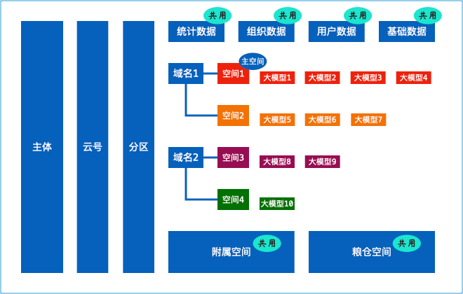
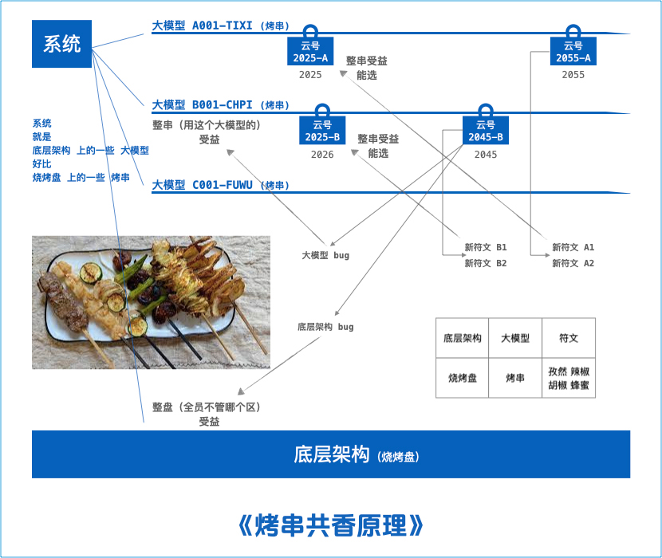
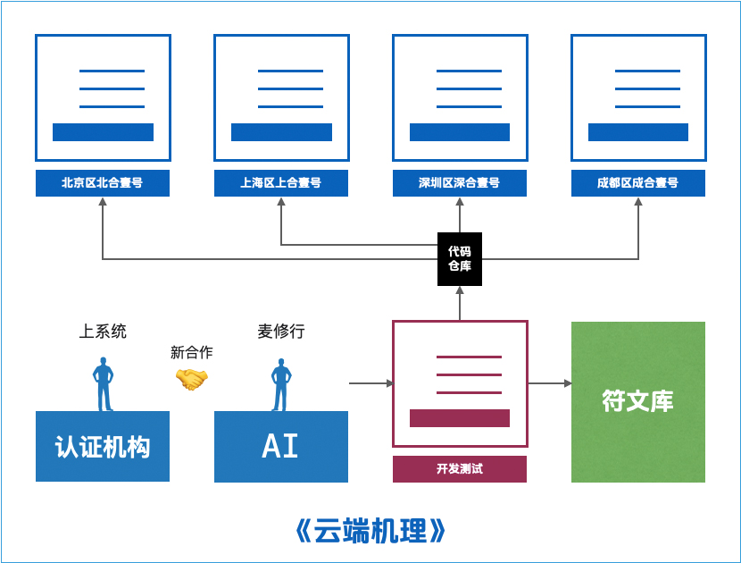
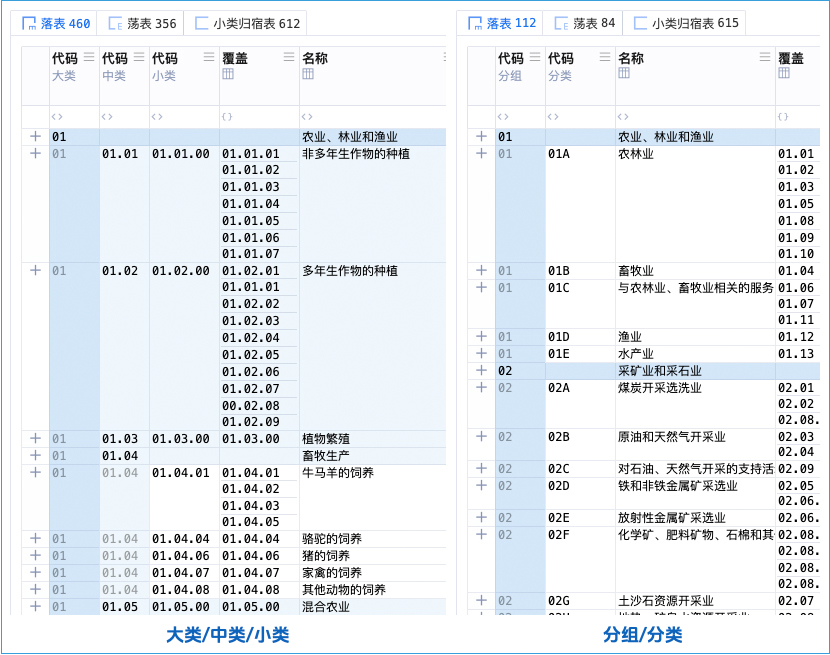
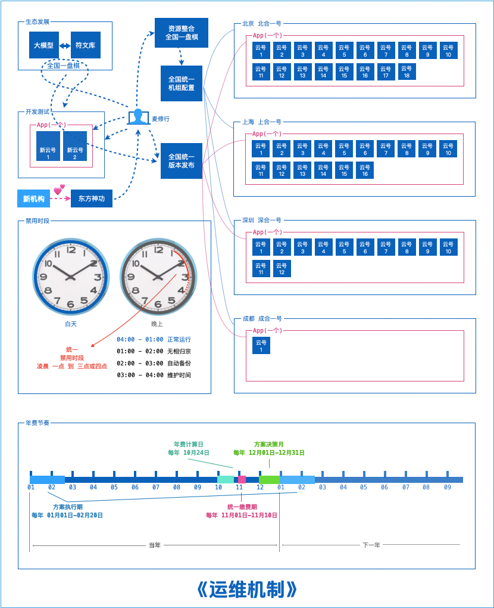

适配高网速、好电脑的，认证机构信息管理系统 <br/>
清爽、高级、惊艳、生态，新时代的驾驭感 <br/>
主理人：麦修行（大江东去，唯我修行）

[麦修行][]&nbsp;&nbsp;&nbsp;&nbsp;[AI->东方神功][东方神功]&nbsp;[剧情][]&nbsp;[人物][]&nbsp;&nbsp;&nbsp;&nbsp;[原理][]&nbsp;&nbsp;[规则][]&nbsp;&nbsp;[价格][]&nbsp;&nbsp;[购买][]&nbsp;&nbsp;&nbsp;&nbsp;[高奢团][]&nbsp;&nbsp;&nbsp;&nbsp;[发展历程][]

[麦修行]: https://github.com/ca3w/BEST
[东方神功]: https://github.com/ca3w/ai-dongfangshengong
[剧情]: https://github.com/ca3w/dongfangernvqing/blob/main/root/BEST.md
[人物]: https://github.com/ca3w/dongfangernvqing/blob/main/root/renwu.md
[原理]: https://github.com/ca3w/key
[规则]: https://github.com/ca3w/rule
[价格]: https://github.com/ca3w/pricing
[购买]: https://github.com/ca3w/howtobuy
[高奢团]: https://github.com/ca3w/tuan
[发展历程]: https://github.com/ca3w/development

***

# 规则

## 基本概念

### CRC

CRC：粗(Cū)算 人(Rén)工 成(Chéng)本，以「1.5倍上海社平工资」为核定标准，即 1 CRC = 1.5倍上海社平工资 <br/>
抹零：CRC抹零抹到百位（例如：12399.00 -> 12300.00），由CRC计算的价格也统一抹零抹到百位，避免争议

CRC最新取值：[CRC][]

[CRC]: https://github.com/ca3w/pricing/blob/main/root/CRC.md

### 分区

四个大区、多个机组、构成合用、资源整合

大区  |机组名称  |家数限额  |建议选择
:----:|:--------:|:--------:|:--------------------------------------------------
北京  |北合一号  |20        |北京 天津 河北 山东 山西 黑龙江 吉林 辽宁 内蒙古
上海  |上合一号  |20        |上海 浙江 江苏 安徽 河南 湖北
深圳  |深合一号  |20        |深圳 广东 香港 澳门 广西 海南 台湾 福建 江西 湖南
成都  |成合一号  |20        |四川 重庆 陕西 宁夏 甘肃 新疆 贵州 云南 青海 西藏

合：构成合用的合、资源整合的合 <br/>
一号：一般叫一号的，真的是一号 <br/>
家数限额：年费数，机构码的数量

ping测速地址如下（目前采用的服务商是阿里云）：

```text
北京/北合一号  oss-cn-beijing.aliyuncs.com
上海/上合一号  oss-cn-shanghai.aliyuncs.com
深圳/深合一号  oss-cn-shenzhen.aliyuncs.com
成都/成合一号  oss-cn-chengdu.aliyuncs.com
```

### 云号

云号由四位纯数字的「机构码」和一位「用途号」组成。其中的一位「用途号」既可以是大写字母，也可以是数字 <br/>
每个「认证机构批准号」，每缴纳一个「机构授权费」，能选定一个「机构码」，其后加「用途号」可作为「云号」

一般情况下，「用途号」应该与欲放置「大模型」的「主空间」的「空间编号」的首字母一致，但不作为强制要求

无论是「机构码」，还是「云号」，都是写在合同里的，一旦确定，终身、永久不可以再做变改，所以请谨慎确定 <br/>
在首次签约时，你可以选定四位纯数字的「机构码」，必须是全平台别人没用过的，作为旗下所有云号的统一前缀

#### 云号用途

根据机构号、云号，进行云端配置、相关资源划分、客户建档、维护识别，以及群成员的昵称，要以云号作为前缀

#### 先到先得

机构号的分配采取的原则是「先到先得」，也就是说谁先使用、就是谁的，如果靓号被别人用了，你只能选别的号

#### 靓号推荐

如果大吞吐、富信息真的是「终极形态」，我方在高级体系、生态发展、资源整合等方方面面，做的真是相当不错 <br/>
未来几十年、甚至是上百年，你都需要与我方进行长期合作，那么一个好号，在这个圈子里一定程度就是身份象征

尊贵|稀有|好记|吉利|幸运|寓意
:--:|:--:|:--:|:--:|:--:|:--:
8888|0001|8848|1688|1666|1314
6666|7777|1008|1818|1616|3399
9999|3333|1234|5858|6688|1088
1111|2222|3721|9898|8866|5988
5188|5555|6789|1388|1366|9988
9188|0000|9527|1618|1816|8899

> 发挥你的聪明才智，选定你的专属靓号 <br/>
> 是否占用、是否可用，需要联系麦修行

如果相中某号，短时间没空、无法上系统，交保号费，我方会保留该号码，如果保号期内签约，保号费可充抵费用

```text
比如：你选定的「机构码」是靓号 8888

    可以使用云号 8888-A 作为体系平台
    可以使用云号 8888-B 作为产品平台
    可以使用云号 8888-E 作为二方平台

就相当于 8888-[0-9,A-Z] 都被你占上了

你的成员，在群里、群昵称

    8888-A 刘备
    8888-A 关羽
    8888-A 张飞
    8888-B 曹操
    8888-B 曹仁
    8888-B 夏侯惇
    8888-B 夏侯渊
    8888-E 袁绍
    8888-E 许攸
```

## 云端玩法

每个「认证机构批准号」，缴纳一个「机构授权费」，通常是一个「使用主体」，但也能内部划分多个「使用主体」 <br/>
每个「使用主体」，需缴纳一个「云号创建费」，能创建一个「云号」，能选定一个「分区」，能绑定多个「域名」 <br/>
想用的「大模型」，都放到这个「云号」里面去，管理员能设置「多个域名」与「多个大模型」的「空间对应关系」 <br/>
「大模型」需要你按照「大模型铸造表」去铸造，「起铸费用」相当于「风险金」，「剑成总价」相当于「总价格」 <br/>
这个「云号」内所有「大模型」，共用一个「文件空间」（分为「附属空间」和「粮仓空间」），共用「支撑数据」 <br/>
共用「支撑数据」：不管你用哪个「域名」访问，「基础数据」、「用户数据」、「组织数据」等等，「是共用的」

由于「使用主体」、「云号」是一一对应的，所以划分「使用主体」就等同于划分「云号」，二者其实是一个意思 <br/>
每个「云号」，能且只能将其中一个「空间」设置为「主空间」，凡是多空间相冲突的地方，都以「主空间」为准



关于年费： <br/>
每个「认证机构批准号」，不看你用几个「云号」，只看你用几个「大区」，你用几个「大区」、就交几个「年费」 <br/>
&nbsp;&nbsp;&nbsp;&nbsp;&nbsp;&nbsp;&nbsp;&nbsp;比如：一个机构持有两个云号： <br/>
&nbsp;&nbsp;&nbsp;&nbsp;&nbsp;&nbsp;&nbsp;&nbsp;&nbsp;&nbsp;&nbsp;&nbsp;&nbsp;&nbsp;&nbsp;&nbsp;都放在北京，那么：交一个「年费」 <br/>
&nbsp;&nbsp;&nbsp;&nbsp;&nbsp;&nbsp;&nbsp;&nbsp;&nbsp;&nbsp;&nbsp;&nbsp;&nbsp;&nbsp;&nbsp;&nbsp;一个放北京、一个放上海，那么：交两个「年费」

关于使用： <br/>
每个「云号」，其使用方、缴费方，以及里面的数据，要和其「机构码」对应的「认证机构批准号」存在隶属关系 <br/>
即：你交一个「机构授权费」所获得的「机构码」是授权你的，你只能建云号给自己用，你不应该建云号给别人用

为什么要划分多个「使用主体」？划分多个「云号」？ <br/>
&nbsp;&nbsp;&nbsp;&nbsp;&nbsp;&nbsp;&nbsp;&nbsp;同机构、两伙人，不想共用「支撑数据」 <br/>
&nbsp;&nbsp;&nbsp;&nbsp;&nbsp;&nbsp;&nbsp;&nbsp;有些空间，需要自己做主空间 <br/>
&nbsp;&nbsp;&nbsp;&nbsp;&nbsp;&nbsp;&nbsp;&nbsp;总之：不想搞在一起

为什么要划分多个「域名」？ <br/>
&nbsp;&nbsp;&nbsp;&nbsp;&nbsp;&nbsp;&nbsp;&nbsp;同云号空间太多，整理整理、归拢归拢 <br/>
&nbsp;&nbsp;&nbsp;&nbsp;&nbsp;&nbsp;&nbsp;&nbsp;例如：把二方的用域名划出去 <br/>
&nbsp;&nbsp;&nbsp;&nbsp;&nbsp;&nbsp;&nbsp;&nbsp;总之：不想搅在一起

## 高端规矩

很多商家都说自己高端，同时符合这七条才是真高端（高端七条）： <br/>
&nbsp;&nbsp;&nbsp;&nbsp;&nbsp;&nbsp;&nbsp;&nbsp;㈠.跨时代：真的值、符合时代的发展趋势，打破了常规 <br/>
&nbsp;&nbsp;&nbsp;&nbsp;&nbsp;&nbsp;&nbsp;&nbsp;㈡.高品质：特别好、能感受到是个好东西，不是个俗物 <br/>
&nbsp;&nbsp;&nbsp;&nbsp;&nbsp;&nbsp;&nbsp;&nbsp;㈢.高价格：非常贵、可能小机构都用不起，属于少数人 <br/>
&nbsp;&nbsp;&nbsp;&nbsp;&nbsp;&nbsp;&nbsp;&nbsp;㈣.一体发展：不搞「版本冻结」，定位是百年企业，可以长期使用 <br/>
&nbsp;&nbsp;&nbsp;&nbsp;&nbsp;&nbsp;&nbsp;&nbsp;㈤.保值保涨：避免「反向早鸟」，买到手不但保值，而且一直涨价 <br/>
&nbsp;&nbsp;&nbsp;&nbsp;&nbsp;&nbsp;&nbsp;&nbsp;㈥.内部透明：消除「疑虑心理」，大家都是一样的，按规交钱完事 <br/>
&nbsp;&nbsp;&nbsp;&nbsp;&nbsp;&nbsp;&nbsp;&nbsp;㈦.爱买不买：不搞「看认下菜」，明码实价做筛选，没有议价必要

### ㈠.跨时代/㈡.高品质/㈢.高价格

符合高端七条，才是好的： <br/>
是不是跨时代，自己理解、自己判断 <br/>
是不是高品质，自己感受、自己判断 <br/>
是不是高价格，自己对比、自己判断

### ㈣.一体发展

不搞「版本冻结」：不做零散固定版本，以后基本不管那种。而是定位百年企业，所有客户一体迭代，对发展负责 <br/>
在2025年上的系统，和2055年的系统， 跑的是一样的代码，只不过用的「大模型」、选的「符文」，不一样而已 <br/>
甚至是未来一百年后，云端依然是云端，依然大吞吐富信息。我们相信有百年的认证机构，我们就能做百年的企业

#### 烤串共香原理



从认证机构的角度理解系统： <br/>
系统就是「底层架构」上的一些「大模型」，好比「烧烤盘」上的一些「烤串」

> 除了「大模型」，其余的都算作「底层架构」，主要是使用「大模型」来管理业务

映射类比对应关系：

底层架构  |大模型  |符文
:---------|:-------|:--------------------
烧烤盘    |烤串    |孜然 辣椒 胡椒 蜂蜜

关于「底层架构/烧烤盘」： <br/>
&nbsp;&nbsp;&nbsp;&nbsp;&nbsp;&nbsp;&nbsp;&nbsp;不管你在哪个区、不管你何种大模型、不管你在任何时间上的系统，都是一样的底层架构，都是一样的烧烤盘 <br/>
&nbsp;&nbsp;&nbsp;&nbsp;&nbsp;&nbsp;&nbsp;&nbsp;绝不是版本冻结，弄好了就再不动了。这个道理，就像你开个某宝店，整个平台要迭代的，需要不断升级更新

关于「大模型/烤串」： <br/>
&nbsp;&nbsp;&nbsp;&nbsp;&nbsp;&nbsp;&nbsp;&nbsp;**三人同串，必有我师**： <br/>
&nbsp;&nbsp;&nbsp;&nbsp;&nbsp;&nbsp;&nbsp;&nbsp;机理造就： <br/>
&nbsp;&nbsp;&nbsp;&nbsp;&nbsp;&nbsp;&nbsp;&nbsp;&nbsp;&nbsp;&nbsp;&nbsp;&nbsp;&nbsp;&nbsp;&nbsp;麦修行设计的这个系统： <br/>
&nbsp;&nbsp;&nbsp;&nbsp;&nbsp;&nbsp;&nbsp;&nbsp;&nbsp;&nbsp;&nbsp;&nbsp;&nbsp;&nbsp;&nbsp;&nbsp;不是把一般功能做的差不多了，让人修修补补，版本冻结，授人以鱼、拿回家自己炖去 <br/>
&nbsp;&nbsp;&nbsp;&nbsp;&nbsp;&nbsp;&nbsp;&nbsp;&nbsp;&nbsp;&nbsp;&nbsp;&nbsp;&nbsp;&nbsp;&nbsp;而是把高级体系做到AI实现了，让人花样百出，符文生态，授人以渔、学神功各出奇招 <br/>
&nbsp;&nbsp;&nbsp;&nbsp;&nbsp;&nbsp;&nbsp;&nbsp;&nbsp;&nbsp;&nbsp;&nbsp;&nbsp;&nbsp;&nbsp;&nbsp;&nbsp;&nbsp;&nbsp;&nbsp;&nbsp;&nbsp;&nbsp;&nbsp;其分工就是： <br/>
&nbsp;&nbsp;&nbsp;&nbsp;&nbsp;&nbsp;&nbsp;&nbsp;&nbsp;&nbsp;&nbsp;&nbsp;&nbsp;&nbsp;&nbsp;&nbsp;&nbsp;&nbsp;&nbsp;&nbsp;&nbsp;&nbsp;&nbsp;&nbsp;麦修行修旷世奇功：AI->东方神功 <br/>
&nbsp;&nbsp;&nbsp;&nbsp;&nbsp;&nbsp;&nbsp;&nbsp;&nbsp;&nbsp;&nbsp;&nbsp;&nbsp;&nbsp;&nbsp;&nbsp;&nbsp;&nbsp;&nbsp;&nbsp;&nbsp;&nbsp;&nbsp;&nbsp;众多机构各出奇招，麦修行以AI实现，以符文区分、以供选择 <br/>
&nbsp;&nbsp;&nbsp;&nbsp;&nbsp;&nbsp;&nbsp;&nbsp;&nbsp;&nbsp;&nbsp;&nbsp;&nbsp;&nbsp;&nbsp;&nbsp;&nbsp;&nbsp;&nbsp;&nbsp;&nbsp;&nbsp;&nbsp;&nbsp;是以烤盘非凡，烤串共香，三人同串，必有我师，实乃大机构以武会友、相互学习之乐事也 <br/>
&nbsp;&nbsp;&nbsp;&nbsp;&nbsp;&nbsp;&nbsp;&nbsp;大神会有： <br/>
&nbsp;&nbsp;&nbsp;&nbsp;&nbsp;&nbsp;&nbsp;&nbsp;&nbsp;&nbsp;&nbsp;&nbsp;&nbsp;&nbsp;&nbsp;&nbsp;就连Excel表， 都有大神，弄好几天， 弄的层次分明，错落有致，清雅秀丽美好的表格 <br/>
&nbsp;&nbsp;&nbsp;&nbsp;&nbsp;&nbsp;&nbsp;&nbsp;&nbsp;&nbsp;&nbsp;&nbsp;&nbsp;&nbsp;&nbsp;&nbsp;系统就更有了，大神会用九剑、飞针、莫言，把数据弄的美美的，清雅秀丽美好的表格

#### 如何理解云端

以北京区为例： <br/>
比如你用上了北京区北合一号，本质是什么呢？ <br/>
本质不是给你单独弄了一套代码、一个数据库......这个小学没毕业的笨蛋做法！ <br/>
本质上是依据云号给你划分Bucket，让你使用，整个云端在代码上是一套，那是超乎想象非常复杂的！ <br/>
全平台的代码量可能会达到5G、10G，那不是一个机构的系统，而是多个机构都在用很多域名解析到上面的云平台 <br/>
这个道理，就像你开个某宝店一样的，那不是专门给你写了一套代码，而是整体是一套，系统只不过是开个号而已

那还有上海区上合一号、深圳区深合一号、成都区成合一号，那又是怎么回事呢？ <br/>
一共四套代码，但这四套是一样的，都是受版本控制的，就是说全国只部署四套，服务于全国的客户。 <br/>
但是如果北京区北合一号限额满了，自然会有北合二号，其他分区也是以此类推，20家放一起进行服务端资源整合



云端优势「三个能真正」：能真正形成良好的发展生态，能真正进行服务端资源整合，能真正值得长期使用的系统 <br/>
&nbsp;&nbsp;&nbsp;&nbsp;&nbsp;&nbsp;&nbsp;&nbsp;能真正形成良好的发展生态： <br/>
&nbsp;&nbsp;&nbsp;&nbsp;&nbsp;&nbsp;&nbsp;&nbsp;&nbsp;&nbsp;&nbsp;&nbsp;&nbsp;&nbsp;&nbsp;&nbsp;一定程度对自我进行限制，是开发商倒逼自己必须走「大模型-符文」的线路，没有退路 <br/>
&nbsp;&nbsp;&nbsp;&nbsp;&nbsp;&nbsp;&nbsp;&nbsp;&nbsp;&nbsp;&nbsp;&nbsp;&nbsp;&nbsp;&nbsp;&nbsp;相当于强制高标准一体化，使开发商对谁都是一样的，不敢糊弄、 步步精进、 走向生态 <br/>
&nbsp;&nbsp;&nbsp;&nbsp;&nbsp;&nbsp;&nbsp;&nbsp;能真正进行服务端资源整合： <br/>
&nbsp;&nbsp;&nbsp;&nbsp;&nbsp;&nbsp;&nbsp;&nbsp;&nbsp;&nbsp;&nbsp;&nbsp;&nbsp;&nbsp;&nbsp;&nbsp;不是一个机组有一堆app、有一堆主进程，而是一个机组只有一个app、只有一个主进程 <br/>
&nbsp;&nbsp;&nbsp;&nbsp;&nbsp;&nbsp;&nbsp;&nbsp;&nbsp;&nbsp;&nbsp;&nbsp;&nbsp;&nbsp;&nbsp;&nbsp;没有多少冗余重复开销， 大部分资源都能很好的共同利用， 真正大幅提高服务端性价比 <br/>
&nbsp;&nbsp;&nbsp;&nbsp;&nbsp;&nbsp;&nbsp;&nbsp;能真正值得长期使用的系统： <br/>
&nbsp;&nbsp;&nbsp;&nbsp;&nbsp;&nbsp;&nbsp;&nbsp;&nbsp;&nbsp;&nbsp;&nbsp;&nbsp;&nbsp;&nbsp;&nbsp;不应该：在科技高速发展的时代，买个200M所谓源代码，放在家里一动不动、夜郎自大 <br/>
&nbsp;&nbsp;&nbsp;&nbsp;&nbsp;&nbsp;&nbsp;&nbsp;&nbsp;&nbsp;&nbsp;&nbsp;&nbsp;&nbsp;&nbsp;&nbsp;&nbsp;&nbsp;&nbsp;&nbsp;&nbsp;&nbsp;&nbsp;&nbsp;发展速度、只会越来越快： <br/>
&nbsp;&nbsp;&nbsp;&nbsp;&nbsp;&nbsp;&nbsp;&nbsp;&nbsp;&nbsp;&nbsp;&nbsp;&nbsp;&nbsp;&nbsp;&nbsp;&nbsp;&nbsp;&nbsp;&nbsp;&nbsp;&nbsp;&nbsp;&nbsp;&nbsp;&nbsp;&nbsp;&nbsp;&nbsp;&nbsp;&nbsp;&nbsp;眨眼间，网速从「印象中的200kb/s」发展到「千兆时代、万兆时代」 <br/>
&nbsp;&nbsp;&nbsp;&nbsp;&nbsp;&nbsp;&nbsp;&nbsp;&nbsp;&nbsp;&nbsp;&nbsp;&nbsp;&nbsp;&nbsp;&nbsp;&nbsp;&nbsp;&nbsp;&nbsp;&nbsp;&nbsp;&nbsp;&nbsp;&nbsp;&nbsp;&nbsp;&nbsp;&nbsp;&nbsp;&nbsp;&nbsp;只要是「一动不动」，即便是好的，将来用不了二十年，也会被淘汰 <br/>
&nbsp;&nbsp;&nbsp;&nbsp;&nbsp;&nbsp;&nbsp;&nbsp;&nbsp;&nbsp;&nbsp;&nbsp;&nbsp;&nbsp;&nbsp;&nbsp;&nbsp;&nbsp;&nbsp;&nbsp;&nbsp;&nbsp;&nbsp;&nbsp;&nbsp;&nbsp;&nbsp;&nbsp;&nbsp;&nbsp;&nbsp;&nbsp;像永动机一样，永先进的系统不存在，只有不断迭代的系统才值得用 <br/>
&nbsp;&nbsp;&nbsp;&nbsp;&nbsp;&nbsp;&nbsp;&nbsp;&nbsp;&nbsp;&nbsp;&nbsp;&nbsp;&nbsp;&nbsp;&nbsp;而应该：在千兆万兆的网速环境，选择大吞吐、 富信息， 放在云端涓滴成河、水宽鱼大 <br/>
&nbsp;&nbsp;&nbsp;&nbsp;&nbsp;&nbsp;&nbsp;&nbsp;&nbsp;&nbsp;&nbsp;&nbsp;&nbsp;&nbsp;&nbsp;&nbsp;&nbsp;&nbsp;&nbsp;&nbsp;&nbsp;&nbsp;&nbsp;&nbsp;错误的选择、没什么未来： <br/>
&nbsp;&nbsp;&nbsp;&nbsp;&nbsp;&nbsp;&nbsp;&nbsp;&nbsp;&nbsp;&nbsp;&nbsp;&nbsp;&nbsp;&nbsp;&nbsp;&nbsp;&nbsp;&nbsp;&nbsp;&nbsp;&nbsp;&nbsp;&nbsp;&nbsp;&nbsp;&nbsp;&nbsp;&nbsp;&nbsp;&nbsp;&nbsp;这种事没可能： <br/>
&nbsp;&nbsp;&nbsp;&nbsp;&nbsp;&nbsp;&nbsp;&nbsp;&nbsp;&nbsp;&nbsp;&nbsp;&nbsp;&nbsp;&nbsp;&nbsp;&nbsp;&nbsp;&nbsp;&nbsp;&nbsp;&nbsp;&nbsp;&nbsp;&nbsp;&nbsp;&nbsp;&nbsp;&nbsp;&nbsp;&nbsp;&nbsp;&nbsp;&nbsp;&nbsp;&nbsp;&nbsp;&nbsp;&nbsp;&nbsp;我三十年前（1995），买了一套源代码 <br/>
&nbsp;&nbsp;&nbsp;&nbsp;&nbsp;&nbsp;&nbsp;&nbsp;&nbsp;&nbsp;&nbsp;&nbsp;&nbsp;&nbsp;&nbsp;&nbsp;&nbsp;&nbsp;&nbsp;&nbsp;&nbsp;&nbsp;&nbsp;&nbsp;&nbsp;&nbsp;&nbsp;&nbsp;&nbsp;&nbsp;&nbsp;&nbsp;&nbsp;&nbsp;&nbsp;&nbsp;&nbsp;&nbsp;&nbsp;&nbsp;今天还在用（2025），依然还非常好用 <br/>
&nbsp;&nbsp;&nbsp;&nbsp;&nbsp;&nbsp;&nbsp;&nbsp;&nbsp;&nbsp;&nbsp;&nbsp;&nbsp;&nbsp;&nbsp;&nbsp;&nbsp;&nbsp;&nbsp;&nbsp;&nbsp;&nbsp;&nbsp;&nbsp;&nbsp;&nbsp;&nbsp;&nbsp;&nbsp;&nbsp;&nbsp;&nbsp;为什么没未来？ <br/>
&nbsp;&nbsp;&nbsp;&nbsp;&nbsp;&nbsp;&nbsp;&nbsp;&nbsp;&nbsp;&nbsp;&nbsp;&nbsp;&nbsp;&nbsp;&nbsp;&nbsp;&nbsp;&nbsp;&nbsp;&nbsp;&nbsp;&nbsp;&nbsp;&nbsp;&nbsp;&nbsp;&nbsp;&nbsp;&nbsp;&nbsp;&nbsp;&nbsp;&nbsp;&nbsp;&nbsp;&nbsp;&nbsp;&nbsp;&nbsp;版本冻结所决定的： <br/>
&nbsp;&nbsp;&nbsp;&nbsp;&nbsp;&nbsp;&nbsp;&nbsp;&nbsp;&nbsp;&nbsp;&nbsp;&nbsp;&nbsp;&nbsp;&nbsp;&nbsp;&nbsp;&nbsp;&nbsp;&nbsp;&nbsp;&nbsp;&nbsp;&nbsp;&nbsp;&nbsp;&nbsp;&nbsp;&nbsp;&nbsp;&nbsp;&nbsp;&nbsp;&nbsp;&nbsp;&nbsp;&nbsp;&nbsp;&nbsp;1995年是JAVA 1.0、PHP 2.0，现在谁还愿意维护这种 <br/>
&nbsp;&nbsp;&nbsp;&nbsp;&nbsp;&nbsp;&nbsp;&nbsp;&nbsp;&nbsp;&nbsp;&nbsp;&nbsp;&nbsp;&nbsp;&nbsp;&nbsp;&nbsp;&nbsp;&nbsp;&nbsp;&nbsp;&nbsp;&nbsp;正确的选择、将来有前途： <br/>
&nbsp;&nbsp;&nbsp;&nbsp;&nbsp;&nbsp;&nbsp;&nbsp;&nbsp;&nbsp;&nbsp;&nbsp;&nbsp;&nbsp;&nbsp;&nbsp;&nbsp;&nbsp;&nbsp;&nbsp;&nbsp;&nbsp;&nbsp;&nbsp;&nbsp;&nbsp;&nbsp;&nbsp;&nbsp;&nbsp;&nbsp;&nbsp;这种事有可能： <br/>
&nbsp;&nbsp;&nbsp;&nbsp;&nbsp;&nbsp;&nbsp;&nbsp;&nbsp;&nbsp;&nbsp;&nbsp;&nbsp;&nbsp;&nbsp;&nbsp;&nbsp;&nbsp;&nbsp;&nbsp;&nbsp;&nbsp;&nbsp;&nbsp;&nbsp;&nbsp;&nbsp;&nbsp;&nbsp;&nbsp;&nbsp;&nbsp;&nbsp;&nbsp;&nbsp;&nbsp;&nbsp;&nbsp;&nbsp;&nbsp;我三十年前（2025），换成了云端系统 <br/>
&nbsp;&nbsp;&nbsp;&nbsp;&nbsp;&nbsp;&nbsp;&nbsp;&nbsp;&nbsp;&nbsp;&nbsp;&nbsp;&nbsp;&nbsp;&nbsp;&nbsp;&nbsp;&nbsp;&nbsp;&nbsp;&nbsp;&nbsp;&nbsp;&nbsp;&nbsp;&nbsp;&nbsp;&nbsp;&nbsp;&nbsp;&nbsp;&nbsp;&nbsp;&nbsp;&nbsp;&nbsp;&nbsp;&nbsp;&nbsp;今天还在用（2055），依然还非常好用 <br/>
&nbsp;&nbsp;&nbsp;&nbsp;&nbsp;&nbsp;&nbsp;&nbsp;&nbsp;&nbsp;&nbsp;&nbsp;&nbsp;&nbsp;&nbsp;&nbsp;&nbsp;&nbsp;&nbsp;&nbsp;&nbsp;&nbsp;&nbsp;&nbsp;&nbsp;&nbsp;&nbsp;&nbsp;&nbsp;&nbsp;&nbsp;&nbsp;为什么有前途？ <br/>
&nbsp;&nbsp;&nbsp;&nbsp;&nbsp;&nbsp;&nbsp;&nbsp;&nbsp;&nbsp;&nbsp;&nbsp;&nbsp;&nbsp;&nbsp;&nbsp;&nbsp;&nbsp;&nbsp;&nbsp;&nbsp;&nbsp;&nbsp;&nbsp;&nbsp;&nbsp;&nbsp;&nbsp;&nbsp;&nbsp;&nbsp;&nbsp;&nbsp;&nbsp;&nbsp;&nbsp;&nbsp;&nbsp;&nbsp;&nbsp;一体发展所决定的、云端机理所决定的： <br/>
&nbsp;&nbsp;&nbsp;&nbsp;&nbsp;&nbsp;&nbsp;&nbsp;&nbsp;&nbsp;&nbsp;&nbsp;&nbsp;&nbsp;&nbsp;&nbsp;&nbsp;&nbsp;&nbsp;&nbsp;&nbsp;&nbsp;&nbsp;&nbsp;&nbsp;&nbsp;&nbsp;&nbsp;&nbsp;&nbsp;&nbsp;&nbsp;&nbsp;&nbsp;&nbsp;&nbsp;&nbsp;&nbsp;&nbsp;&nbsp;老客户不会被抛弃，也无法抛弃，大家永远都是一体的 <br/>
&nbsp;&nbsp;&nbsp;&nbsp;&nbsp;&nbsp;&nbsp;&nbsp;&nbsp;&nbsp;&nbsp;&nbsp;&nbsp;&nbsp;&nbsp;&nbsp;&nbsp;&nbsp;&nbsp;&nbsp;&nbsp;&nbsp;&nbsp;&nbsp;&nbsp;&nbsp;&nbsp;&nbsp;&nbsp;&nbsp;&nbsp;&nbsp;&nbsp;&nbsp;&nbsp;&nbsp;&nbsp;&nbsp;&nbsp;&nbsp;新客户是前进动力，会带动改进，老客户会跟着受益的

同样是找麦修行上的云端系统，哪里不一样呢？

七大不一样： <br/>

项目      |说明&nbsp;&nbsp;&nbsp;&nbsp;&nbsp;&nbsp;&nbsp;&nbsp;&nbsp;&nbsp;&nbsp;&nbsp;&nbsp;&nbsp;&nbsp;&nbsp;&nbsp;&nbsp;&nbsp;&nbsp;&nbsp;&nbsp;&nbsp;&nbsp;&nbsp;&nbsp;&nbsp;&nbsp;&nbsp;&nbsp;&nbsp;&nbsp;&nbsp;&nbsp;&nbsp;&nbsp;&nbsp;&nbsp;&nbsp;&nbsp;&nbsp;&nbsp;&nbsp;&nbsp;
:---------|:--------------------
分区      |北京 上海 深圳 成都
云号      |8888 6666 9999 1111
域名      |
系统设置  |
大模型    |
符文      |
内容数据  |

代码永远都一样： <br/>
&nbsp;&nbsp;&nbsp;&nbsp;&nbsp;&nbsp;&nbsp;&nbsp;和别人比代码永远都是一样的，因为这是云端，是一体的、是发展的！ <br/>
&nbsp;&nbsp;&nbsp;&nbsp;&nbsp;&nbsp;&nbsp;&nbsp;不是让你把代码买到家里面去，那就不一样了，版本冻结、不发展了。

使用云端系统的优越感如何建立？ <br/>
&nbsp;&nbsp;&nbsp;&nbsp;&nbsp;&nbsp;&nbsp;&nbsp;我是认同东方神功的，我也相信大吞吐、富信息是好的，这是蓝星最好的圈子， <br/>
&nbsp;&nbsp;&nbsp;&nbsp;&nbsp;&nbsp;&nbsp;&nbsp;在这个最好的圈子里，不仅是一体发展的，而且我做了最适合我的选择（符文）

#### 符文的规矩

符文是怎样产生的？

认证机构的做法不一样，管理不一、需求不一、喜好不一......以QMS、EMS、OHSMS的《技术领域划分表》为例 <br/>
&nbsp;&nbsp;&nbsp;&nbsp;&nbsp;&nbsp;&nbsp;&nbsp;有的机构这样划分：大类/中类/小类 <br/>
&nbsp;&nbsp;&nbsp;&nbsp;&nbsp;&nbsp;&nbsp;&nbsp;有的机构这样划分：分组/分类 <br/>
&nbsp;&nbsp;&nbsp;&nbsp;&nbsp;&nbsp;&nbsp;&nbsp;有的机构这样划分：分类



参见上述《云端机理》，由于一体发展的原因，麦修行能且只能以「符文」的方式来解决差异化，这就产生了符文

和符文相关的规矩：

符文的命名权、解释权、评级权，统一由麦修行一人来决定，各个机构每年查阅最新《发展报告》，把脉系统发展
> 《发展报告》是指：类似《2025认证机构云平台发展报告》这种，关于系统的、每年发布的，内部分享的文件

什么叫作「把脉系统发展」？ <br/>
&nbsp;&nbsp;&nbsp;&nbsp;&nbsp;&nbsp;&nbsp;&nbsp;作为认证机构的高层 <br/>
&nbsp;&nbsp;&nbsp;&nbsp;&nbsp;&nbsp;&nbsp;&nbsp;每年花一天中的一点时间，扫一眼最新《发展报告》 <br/>
&nbsp;&nbsp;&nbsp;&nbsp;&nbsp;&nbsp;&nbsp;&nbsp;看看和我一样用云的机构，尤其是和我使用相同大模型的机构，搞没搞出“妖蛾子” <br/>
&nbsp;&nbsp;&nbsp;&nbsp;&nbsp;&nbsp;&nbsp;&nbsp;同云同串有我师，如果发现这个“妖蛾子”可不是一般的“妖蛾子”，分明就是个“好点子”、“好办法”、“好思路” <br/>
&nbsp;&nbsp;&nbsp;&nbsp;&nbsp;&nbsp;&nbsp;&nbsp;尊重符文相关的规矩，详细阅读相关的说明，可以像游戏一样，装配这个符文，这样就实现了系统的与时俱进

一体发展、烤串共香、大模型、符文的深意是什么？ <br/>
&nbsp;&nbsp;&nbsp;&nbsp;&nbsp;&nbsp;&nbsp;&nbsp;这一套是在做什么呢？ <br/>
&nbsp;&nbsp;&nbsp;&nbsp;&nbsp;&nbsp;&nbsp;&nbsp;这是麦修行以巧妙的方式，将系统建设的能量合一 <br/>
&nbsp;&nbsp;&nbsp;&nbsp;&nbsp;&nbsp;&nbsp;&nbsp;一家机构的系统建设精力，不仅是有限的，而且是没有后劲的，最终很难成大气候 <br/>
&nbsp;&nbsp;&nbsp;&nbsp;&nbsp;&nbsp;&nbsp;&nbsp;如果能够将每一家的精力，巧妙聚集起来，持续有新的动力源，我相信未来终究会缔造出非常伟大的信息系统 <br/>
&nbsp;&nbsp;&nbsp;&nbsp;&nbsp;&nbsp;&nbsp;&nbsp;所以我希望大家能够觉醒，要有长远目光，要有行业整合意识，融入这个新时代大家都贡献能量的能量场之中

### ㈤.保值保涨

保涨，是保涨价的意思，主要针对的是「机构授权费」，就是说很长时间不可能降价，只会是随经济发展越来越贵 <br/>
保值保涨的合理性解读：本来就是十分先进的，一体发展的机制决定：必然不断进步，品质越来越好自然越来越贵

### ㈥.内部透明

由于内部每年都要发布：类似《2025认证机构云平台发展报告》这种文件，这就导致有些信息必须是内部透明的

#### 内部透明的好处：⑴.消除疑虑、⑵.收费透明、⑶.执神牛耳、⑷.更加规范

#### ⑴.消除疑虑

只有透明才能消除你心中的各种疑虑。但这个透明是内部的、是有原则的，不能违背利益边界，透明不等于牺牲

#### ⑵.收费透明

你怎么知道别人也是按规则付费的呢？

麦修行发布在Git仓库中的价格，是相当于发布在第三方上的，是数字签名的、是可验证的，是有版本、有历史的 <br/>
《发展报告》来自同一个群里的同一个文件， 里面有云号机构对应关系，以及什么时间上的系统，内部是公开的 <br/>
而且允许相互询问价格，甚至是质疑的声音， 因为所有费用都是严格按规则收取的，一切质疑都是能解释清楚的

别人的「机构授权费」价格较低： 那是因为买的时间比你要早，那个时间谁买都是那个价格，全都是明码标价的 <br/>
所谓的「收费透明」就是按规则， 麦修行对所有机构都一样的，定规则就是用来严格执行的，全都是按规则付钱

#### ⑶.执神牛耳

要打破孤岛局面，一体发展，两个要点：一是：和别的机构构成合用、资源整合，二是在符文方面、借鉴别的机构

别的认证机构，和麦修行弄出来好东西？做成符文，你选你用，这真的可能吗？关于这一点麦修行是这样想的： <br/>
&nbsp;&nbsp;&nbsp;&nbsp;&nbsp;&nbsp;&nbsp;&nbsp;如果是基于基本的东西，可能性并不大，至少好不到哪去，建几个表点来点去吗？你还嫌表不够多吗？ <br/>
&nbsp;&nbsp;&nbsp;&nbsp;&nbsp;&nbsp;&nbsp;&nbsp;但如果基于高级的体系，这完全有可能，就是说他们可能基于九剑、飞针、莫言，那可是太有可能了。 <br/>
&nbsp;&nbsp;&nbsp;&nbsp;&nbsp;&nbsp;&nbsp;&nbsp;所以是：执神牛耳，执东方神功之牛耳，抓住别人根据东方神功搞出来的好东西，保持自己的先进性。 <br/>
&nbsp;&nbsp;&nbsp;&nbsp;&nbsp;&nbsp;&nbsp;&nbsp;甚至是：不是太有可能，而是绝对会的！ <br/>
&nbsp;&nbsp;&nbsp;&nbsp;&nbsp;&nbsp;&nbsp;&nbsp;这就好比一个侠客，每天都是这样上班：拿着宝剑使用剑法， <br/>
&nbsp;&nbsp;&nbsp;&nbsp;&nbsp;&nbsp;&nbsp;&nbsp;如果他只会基本功：刺、劈、斩、点，收剑入鞘。每天重复，就这样了。 <br/>
&nbsp;&nbsp;&nbsp;&nbsp;&nbsp;&nbsp;&nbsp;&nbsp;但他如果会高级的：纵剑式、横剑式、落剑式、荡剑式，再加上飞针、再加上子剑...... <br/>
&nbsp;&nbsp;&nbsp;&nbsp;&nbsp;&nbsp;&nbsp;&nbsp;这得等他实际运用、实际感受、实际理解，等他消化明白了、会玩了，那么就会激活他的创造性。 <br/>
&nbsp;&nbsp;&nbsp;&nbsp;&nbsp;&nbsp;&nbsp;&nbsp;我这一块是不是可以「这样纵」、是不是可以「这样落」、是不是可以「这样荡」......这就会搞出好东西。

当你认为东方神功是先进的、是全天下，那么，你再做到执神牛耳，执东方神功之牛耳，那么：你就拥有了全天下

#### ⑷.更加规范

可以这样理解：这个云其实就是一个平台，通过这个平台你和其他机构构成良好的资源整合，形成良好的符文生态

#### 会内部透明的内容

* 你的云号、分区、加入云平台的时间
* 你用了哪些大模型、装配了哪些符文
* 你是否参与高奢团、以及命中率统计
* 你是否按规则交费（我方解释质疑时）

#### 不会内部透明的内容

大原则是：我方**不会**内部透明，**任何**机构的内容数据 <br/>
未经签约许可，我方不会向任何人透露您的内容数据

内容数据是指：系统内的数据，组织、证书、用户等

### ㈦.爱买不买

就是云的，就是贵的，这是筛选，爱买不买

## 发展报告

每年定期内部发布发展报告，大体内容如下：

```text
《2025认证机构云平台发展报告》

2025年四个分区基本状况
2025年平台发展基本情况
最新符文汇总及相关说明
2025年高奢团高段位测评
...

附录：分区、云号、机构对应关系表
...

```

## 定价机制

定位百年企业，划分发展周期，一个周期一个办法，一经确定不再变改！ <br/>
每个周期会考虑政策的连续性，保障老用户的利益，一个周期一个阶段。

周期名    |周期长  |起始年  |到期年  |使命                                           |明谋
----------|--------|--------|--------|-----------------------------------------------|-----------------------------------------------
乙巳周期  |30年    |2025    |2055    |清爽之人，苦系统久矣<br/>扫灭穷信息，还归清爽  |以富信息，颠覆穷信息<br/>用高级体系，碾压低端

### 乙巳周期（2025-2055）

> 时代背景：网速由「印象中的200kb/s」 巨变为「科幻般的千兆万兆」

#### 机构授权费的确定

定价标准： <br/>
&nbsp;&nbsp;&nbsp;&nbsp;&nbsp;&nbsp;&nbsp;&nbsp;麦修行认为10倍，很难开发到对等品质 <br/>
&nbsp;&nbsp;&nbsp;&nbsp;&nbsp;&nbsp;&nbsp;&nbsp;留一些保涨空间，以便实现每年都涨价

以2025年的购买力和CRC进行评估： <br/>
&nbsp;&nbsp;&nbsp;&nbsp;&nbsp;&nbsp;&nbsp;&nbsp;麦修行认为 3000 万人民币，很难开发到：高级体系、由AI来生成，这种品质 <br/>
&nbsp;&nbsp;&nbsp;&nbsp;&nbsp;&nbsp;&nbsp;&nbsp;十分之一是 300 万人民币， 折合约 163.04 CRC， 留出 63.04 CRC 上涨空间 <br/>

机构授权费的确定： <br/>
&nbsp;&nbsp;&nbsp;&nbsp;&nbsp;&nbsp;&nbsp;&nbsp;保涨CRC：起始为 100 CRC ，视发展情况不定期上涨，理论最高涨到 163 CRC <br/>
&nbsp;&nbsp;&nbsp;&nbsp;&nbsp;&nbsp;&nbsp;&nbsp;因为开发成本太高，以及很可能供不应求的双重原因，不排除会暴涨、会涨冒了 <br/>
&nbsp;&nbsp;&nbsp;&nbsp;&nbsp;&nbsp;&nbsp;&nbsp;富信息、高级体系，等到将来发展成熟了，对穷信息，是颠覆级碾压、绝对碾压 <br/>
&nbsp;&nbsp;&nbsp;&nbsp;&nbsp;&nbsp;&nbsp;&nbsp;价值观：你买不起，那是你的事，我不要市场占有率，我只要真的好、真正高端 <br/>
&nbsp;&nbsp;&nbsp;&nbsp;&nbsp;&nbsp;&nbsp;&nbsp;事实上：非常便宜、非常的划算，这才是真正的系统，可遇不可求的、爱买不买 <br/>
&nbsp;&nbsp;&nbsp;&nbsp;&nbsp;&nbsp;&nbsp;&nbsp;有人、而且在中国，把系统做到：AI、艺术级的程度，那是你的福分、良心产品

#### 基础年费的确定

定价标准： <br/>
&nbsp;&nbsp;&nbsp;&nbsp;&nbsp;&nbsp;&nbsp;&nbsp;哪怕是一家在用，不赚钱不赔钱能运行 <br/>
&nbsp;&nbsp;&nbsp;&nbsp;&nbsp;&nbsp;&nbsp;&nbsp;如果用的家数多，资源整合会提升配置

以2025年的购买力和CRC进行评估： <br/>
&nbsp;&nbsp;&nbsp;&nbsp;&nbsp;&nbsp;&nbsp;&nbsp;麦修行精算了下，每年需要约 340979.85 元人民币，才能让一个区初步运行 <br/>
&nbsp;&nbsp;&nbsp;&nbsp;&nbsp;&nbsp;&nbsp;&nbsp;折合约 18.53 CRC，由于流量具有不确定性，所以向上取整年费定为 20 CRC

基础年费的确定： <br/>
&nbsp;&nbsp;&nbsp;&nbsp;&nbsp;&nbsp;&nbsp;&nbsp;固定CRC：20 CRC

#### 附加年费的确定

附加年费一般和基础年费价格相等，以「高奢团」的方式，由麦修行统一组织，属高段位资源整合 <br/>
随着发展保留灵活调整的可能，以维系「高奢团」的原则：虽然是高价、奢豪，但性价比也是极高

#### 云号创建费的确定

云号创建费和基础年费价格相等

#### 大模型铸造费用的确定

大模型铸造费用，首先「一般主剑」按大概的工时成本进行评估，其余按一定规律做一些上下调整

价值定位       |判断依据            |定价模式  |起铸费用  |剑成总价
--------------:|:-------------------|:--------:|---------:|---------:
👑专属重剑     |&nbsp;&nbsp;&nbsp;&nbsp;&nbsp;&nbsp;&nbsp;&nbsp;&nbsp;&nbsp;&nbsp;&nbsp;&nbsp;&nbsp;&nbsp;&nbsp;&nbsp;&nbsp;&nbsp;&nbsp;&nbsp;&nbsp;&nbsp;&nbsp;主剑 + 复杂 + 小众  |四倍模式  |12 CRC    |20 CRC
💎特制重剑     |&nbsp;&nbsp;&nbsp;&nbsp;&nbsp;&nbsp;&nbsp;&nbsp;&nbsp;&nbsp;&nbsp;&nbsp;&nbsp;&nbsp;&nbsp;&nbsp;&nbsp;&nbsp;&nbsp;&nbsp;&nbsp;&nbsp;&nbsp;&nbsp;主剑 + 复杂         |三倍模式  |9 CRC     |15 CRC
🌈🍭主剑      |&nbsp;&nbsp;&nbsp;&nbsp;&nbsp;&nbsp;&nbsp;&nbsp;&nbsp;&nbsp;&nbsp;&nbsp;&nbsp;&nbsp;&nbsp;&nbsp;&nbsp;&nbsp;&nbsp;&nbsp;&nbsp;&nbsp;&nbsp;&nbsp;主剑                |二倍模式  |6 CRC     |10 CRC
🔹小剑         |&nbsp;&nbsp;&nbsp;&nbsp;&nbsp;&nbsp;&nbsp;&nbsp;&nbsp;&nbsp;&nbsp;&nbsp;小剑                |一倍模式  |3 CRC      |5 CRC
🧩从剑         |从剑                |从剑模式  |1 CRC      |3 CRC

#### 资源整合策略

<br/>&nbsp;全国家数&nbsp;&nbsp;  |整合容量<br/>/年费单元  |整合资源包<br/>/年费单元  |<br/>配置提升  |<br/>与时俱进&nbsp;&nbsp;&nbsp;&nbsp;&nbsp;&nbsp;&nbsp;&nbsp;&nbsp;&nbsp;&nbsp;&nbsp;&nbsp;&nbsp;&nbsp;&nbsp;&nbsp;&nbsp;&nbsp;&nbsp;&nbsp;&nbsp;&nbsp;
:---:|-----------------:|:-------:|----------|:-------------------
10+  |300 x 100G = 30T  |3.0 CRC  |--        |升级换代、迭代升级
10   |300 x 100G = 30T  |3.0 CRC  |隐性提升  |升级换代、迭代升级
9    |270 x 100G = 27T  |2.7 CRC  |隐性提升  |升级换代、迭代升级
8    |240 x 100G = 24T  |2.4 CRC  |隐性提升  |升级换代、迭代升级
7    |210 x 100G = 21T  |2.1 CRC  |隐性提升  |升级换代、迭代升级
6    |180 x 100G = 18T  |1.8 CRC  |隐性提升  |升级换代、迭代升级
5    |150 x 100G = 15T  |1.5 CRC  |隐性提升  |升级换代、迭代升级
4    |120 x 100G = 12T  |1.2 CRC  |隐性提升  |升级换代、迭代升级
3    |90 x 100G = 9T    |0.9 CRC  |隐性提升  |升级换代、迭代升级
2    |60 x 100G = 6T    |0.6 CRC  |隐性提升  |升级换代、迭代升级
1    |30 x 100G = 3T    |0.3 CRC  |隐性提升  |升级换代、迭代升级

单家修为：设想某机构实现了高级体系、由AI来生成，这种品质。拥有和我方对等量级修为，自行部署、自行运维

我方资源整合的战略意图：通过10家机构的逐步整合，最终实现：相比于「单家修为」，要整合出2-3倍的性价比 <br/>
逐步的形成资源整合优势：不算人工、不算虚的、不算溢出效应，相比于「单家修为」，至少依然有2倍的性价比

隐性提升：随着家数增多，投入逐渐加大，在配置上会慢慢提升，效果一般不能明显感受得到，但是确实是在提升 <br/>
升级换代、迭代升级：长时间可持续发展，服务器硬件升级换代、服务器的软件也要迭代升级，信息系统一体发展

资源整合的计算方法：按全国收到年费的个数，这个就是全国家数，全国一盘棋、统一的计算资源整合的利好反馈 <br/>
年费对应多云号问题：如果不约定，整合容量、整合资源包会平摊到每个云号上，如果有约定，按约定比例来发放

#### 特大机构另当别论

此规则的制定针对的是一般机构，而非特大机构。特大机构由于体量庞大，难以进行资源整合（别的机构不会愿意）

特大机构要单独定价，我方能接受的合作框架是： <br/>
&nbsp;&nbsp;&nbsp;&nbsp;&nbsp;&nbsp;&nbsp;&nbsp;单独一个机组：天字一号 <br/>
&nbsp;&nbsp;&nbsp;&nbsp;&nbsp;&nbsp;&nbsp;&nbsp;&nbsp;&nbsp;&nbsp;&nbsp;机构授权费：1200 CRC <br/>
&nbsp;&nbsp;&nbsp;&nbsp;&nbsp;&nbsp;&nbsp;&nbsp;&nbsp;&nbsp;&nbsp;&nbsp;&nbsp;&nbsp;&nbsp;&nbsp;基础年费：180 CRC <br/>
&nbsp;&nbsp;&nbsp;&nbsp;&nbsp;&nbsp;&nbsp;&nbsp;高奢对等品质：我方要30%的利润

## 运维机制



### 云端大船

云端宛若大船，老客户和新客户都是大船上的一员，老客户撑起了服务端资源整合，新客户提供了新鲜的前进动力 <br/>
麦修行是船长，无论老客户还是新客户都是一样的，老客户坐看风景，新客户划船，大家一起驶向更加美好的未来

#### 生态发展 全国一盘棋

不管你是什么时候上的系统、不管在哪个区，全国都一样的、大家用的都是一个App中的云号， 都是一体迭代更新 <br/>
任何时候、任何符文，只要符合使用的条件，都是可以用的，大家用的都是一个生态中的系统，一体发展利益捆绑

#### 资源整合 全国一盘棋

哪怕整个成都大区就你一家机构，那也和北京、上海、深圳，几乎是一样的机组配置，全国上交年费统一提高配置 <br/>
由于上游服务商供货不全的原因，成都和北京、上海、深圳，可能有一些微弱的差异，对整体性能不会有明显影响

### 禁用时段

时间&nbsp;&nbsp;&nbsp;&nbsp;&nbsp;&nbsp;&nbsp;&nbsp;&nbsp;&nbsp;&nbsp;&nbsp;&nbsp;&nbsp;&nbsp;&nbsp;&nbsp;&nbsp;&nbsp;&nbsp;&nbsp;&nbsp;&nbsp;&nbsp;&nbsp;&nbsp;&nbsp;&nbsp;&nbsp;&nbsp;&nbsp;&nbsp;&nbsp;&nbsp;&nbsp;&nbsp;&nbsp;&nbsp;&nbsp;&nbsp;&nbsp;&nbsp;&nbsp;&nbsp;&nbsp;&nbsp;&nbsp;&nbsp;&nbsp;&nbsp;&nbsp;&nbsp;&nbsp;&nbsp;&nbsp;&nbsp;&nbsp;&nbsp;&nbsp;&nbsp;&nbsp;&nbsp;&nbsp;&nbsp;&nbsp;&nbsp;&nbsp;&nbsp;&nbsp;&nbsp;&nbsp;  |用途&nbsp;&nbsp;&nbsp;&nbsp;&nbsp;&nbsp;&nbsp;&nbsp;&nbsp;&nbsp;&nbsp;&nbsp;&nbsp;&nbsp;&nbsp;&nbsp;&nbsp;&nbsp;&nbsp;&nbsp;&nbsp;&nbsp;&nbsp;&nbsp;&nbsp;&nbsp;&nbsp;&nbsp;&nbsp;&nbsp;&nbsp;&nbsp;&nbsp;&nbsp;&nbsp;  |说明&nbsp;&nbsp;&nbsp;&nbsp;&nbsp;&nbsp;&nbsp;&nbsp;&nbsp;&nbsp;&nbsp;&nbsp;&nbsp;&nbsp;&nbsp;&nbsp;&nbsp;&nbsp;&nbsp;&nbsp;&nbsp;&nbsp;&nbsp;&nbsp;&nbsp;&nbsp;&nbsp;&nbsp;&nbsp;&nbsp;&nbsp;&nbsp;&nbsp;&nbsp;&nbsp;&nbsp;&nbsp;&nbsp;&nbsp;&nbsp;&nbsp;&nbsp;&nbsp;&nbsp;&nbsp;&nbsp;&nbsp;&nbsp;&nbsp;&nbsp;&nbsp;&nbsp;&nbsp;
:-----------------------------------------|:---------------------|:-----------------------------
🥏04:00(凌晨四点) - 01:00(次日凌晨一点)  |🥏正常运行            |
🛠01:00(凌晨一点) - 04:00(凌晨四点)      |🛠禁用时段            |
🛠01:00(凌晨一点) - 02:00(凌晨二点)      |🛠禁用时段：无相归宗  |
🛠02:00(凌晨二点) - 03:00(凌晨三点)      |🛠禁用时段：自动备份  |每天自动、每周人工检查一次
🛠03:00(凌晨三点) - 04:00(凌晨四点)      |🛠禁用时段：维护时间  |不一定每天都有人工维护任务

> 每天01:00(凌晨一点)，机组平滑终止使用，依次进行无相归宗、自动备份，完成后自动判断是否有人工维护任务 <br/>
> 如果没有人工维护任务，最迟03:00(凌晨三点)恢复使用， 如果有人工维护任务，最迟04:00(凌晨四点)恢复使用

### 年费节奏

每年&nbsp;&nbsp;&nbsp;&nbsp;&nbsp;&nbsp;&nbsp;&nbsp;&nbsp;&nbsp;&nbsp;&nbsp;&nbsp;&nbsp;&nbsp;&nbsp;&nbsp;&nbsp;&nbsp;&nbsp;&nbsp;&nbsp;&nbsp;&nbsp;&nbsp;&nbsp;&nbsp;&nbsp;&nbsp;&nbsp;&nbsp;&nbsp;&nbsp;&nbsp;&nbsp;&nbsp;&nbsp;&nbsp;&nbsp;&nbsp;&nbsp;&nbsp;&nbsp;&nbsp;&nbsp;&nbsp;&nbsp;&nbsp;&nbsp;&nbsp;&nbsp;&nbsp;&nbsp;&nbsp;&nbsp;&nbsp;&nbsp;&nbsp;&nbsp;&nbsp;&nbsp;&nbsp;&nbsp;&nbsp;&nbsp;&nbsp;&nbsp;&nbsp;&nbsp;&nbsp;&nbsp;  |节奏&nbsp;&nbsp;&nbsp;&nbsp;&nbsp;&nbsp;&nbsp;&nbsp;&nbsp;&nbsp;&nbsp;&nbsp;&nbsp;&nbsp;&nbsp;&nbsp;&nbsp;&nbsp;&nbsp;&nbsp;&nbsp;&nbsp;&nbsp;&nbsp;&nbsp;&nbsp;&nbsp;&nbsp;&nbsp;&nbsp;&nbsp;&nbsp;&nbsp;&nbsp;&nbsp;  |说明&nbsp;&nbsp;&nbsp;&nbsp;&nbsp;&nbsp;&nbsp;&nbsp;&nbsp;&nbsp;&nbsp;&nbsp;&nbsp;&nbsp;&nbsp;&nbsp;&nbsp;&nbsp;&nbsp;&nbsp;&nbsp;&nbsp;&nbsp;&nbsp;&nbsp;&nbsp;&nbsp;&nbsp;&nbsp;&nbsp;&nbsp;&nbsp;&nbsp;&nbsp;&nbsp;&nbsp;&nbsp;&nbsp;&nbsp;&nbsp;&nbsp;&nbsp;&nbsp;&nbsp;&nbsp;&nbsp;&nbsp;&nbsp;&nbsp;&nbsp;&nbsp;&nbsp;&nbsp;
:-----------------------------------------|:---------------------|:-----------------------------
📣10月01日 - 10月24日                    |📣计算年费、通知缴费  |
🏦11月01日 - 11月10日                    |🏦统一缴费            |
✍️12月01日 - 12月31日                    |✍️方案决策            |下一年度全国统一机组配置方案
📋01月01日 - 02月20日                    |📋方案执行            |

#### 通知缴费的方式

10月24日：系统通知（admin账号）、邮件通知（云端管理者代表），群文件（20xx年度年费核算表） <br/>
11月11日：对未付费的机构予以电话通知，请于11月30日前完成缴费，否则影响方案决策、视为逾期

#### 机组运维的原理

麦修行每年「01月01日 - 02月20日」，完成对机组的上游续费，上游到期时间一定不会也是「下一年的 02月20日」 <br/>
会留有管理空间，到期时间至少会是「下一年的 06月30日」，甚至更久，以确保运维的安全性，持续服务的安全性
