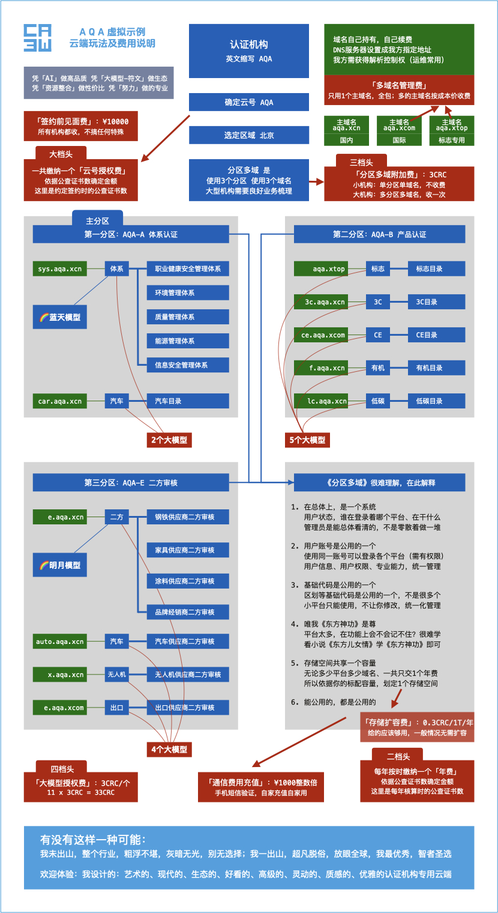

以东方文化为底蕴缔造轻奢认证机构管理系统 <br/>
适配高网速、符合时代，高维、上色、灵动 <br/>
主理人：麦修行（大江东去，唯我修行）

[麦修行][]&nbsp;&nbsp;&nbsp;&nbsp;[AI->东方神功][东方神功]&nbsp;[剧情][]&nbsp;[人物][]&nbsp;&nbsp;&nbsp;&nbsp;[原理][]&nbsp;&nbsp;[规则][]&nbsp;&nbsp;[价格][]&nbsp;&nbsp;[购买][]&nbsp;&nbsp;&nbsp;&nbsp;[Excel-Email][]&nbsp;[大模型-符文][]&nbsp;&nbsp;&nbsp;&nbsp;[发展历程][]

[麦修行]: https://github.com/ca3w/BEST
[东方神功]: https://github.com/ca3w/ai-dongfangshengong
[剧情]: https://github.com/ca3w/dongfangernvqing/blob/main/root/BEST.md
[人物]: https://github.com/ca3w/dongfangernvqing/blob/main/root/renwu.md
[原理]: https://github.com/ca3w/key
[规则]: https://github.com/ca3w/rule
[价格]: https://github.com/ca3w/pricing
[购买]: https://github.com/ca3w/howtobuy
[Excel-Email]: https://github.com/ca3w/excel-email
[大模型-符文]: https://github.com/ca3w/largemodel-rune
[发展历程]: https://github.com/ca3w/development

***

# 规则

不只是有模有样，更是有规有矩。

## 区域

区域  |建议选择
:----:|:--------------------------------------------------
北京  |北京 天津 河北 山东 山西 黑龙江 吉林 辽宁 内蒙古
上海  |上海 浙江 江苏 安徽 河南 湖北
深圳  |深圳 广东 香港 澳门 广西 海南 台湾 福建 江西 湖南
成都  |四川 重庆 陕西 宁夏 甘肃 新疆 贵州 云南 青海 西藏

ping测速地址如下（目前采用的服务商是阿里云）：

```text
北京  $ ping oss-cn-beijing.aliyuncs.com
上海  $ ping oss-cn-shanghai.aliyuncs.com
深圳  $ ping oss-cn-shenzhen.aliyuncs.com
成都  $ ping oss-cn-chengdu.aliyuncs.com
```

## 云号

「云号」一般应是认证机构缩写，初次签约时和我方确定，一经确定终身不应该变改，极端情况的变改走特殊程序 <br/>
每个「云号」需要选定一个服务器所在的区域（北京、上海、深圳、成都，四选一），需要缴纳一个「云号授权费」 <br/>
每个「云号」需要每年按规定缴纳**一个**「年费」维系使用，否则视为弃用，会被销号，再次购买仍需重新获得授权

### 云号的分区多域

小型机构的云号都是单区单域（一个分区、一个域名），大型机构的云号可能会是分区多域（多个分区、多个域名） <br/>
如果需要使用分区多域，需要缴纳「分区多域附加费」，这个费用是一次性付费，具体如何分区多域，需具体协商

#### 分区多域的合规性

同一「云号」下的所有「分区」、所有「域名」及「内容」，必须归属于同一个「认证机构批准号/认证机构批准书」

```text
A机构 开个分区，买个模型，绑个域名，给 D机构 使用，属于违规的，是不允许的
A机构 和 D机构 是不是一个，依据 「认证机构批准号/认证机构批准书」 来判断
```

#### 「分区多域」的统一「分区后缀」

分区后缀  |代表类别
---------:|--------------------
-A        |体系认证
-B        |产品认证
-C        |服务认证
-D        |培训管理
-E        |二方审核
-F        |认证机构的官方网站

特殊情况特殊后缀，具体情况具体协商

#### 是否「分区多域」的「判断依据」

只做单一类别（上述类别：体系认证/产品认证/服务认证，只做其一），而且有且只有一个域名，视为「单区单域」 <br/>
涉及2个分区，绑定1个域名；涉及1个分区，绑定2个域名，都视为「分区多域」，需要缴纳1个「分区多域附加费」

## 大模型-符文

拥有「云号」之后，还需要购买相应的「大模型」，依托「大模型」建立起应用（项目分类），才能进一步的使用 <br/>
大模型的好处，请看「[原理][]」里的《烤串共香原理》，有哪些大模型、符文，请看「[大模型-符文][]」 （没有可建）

所有的大模型，要缴纳「大模型授权费」才能放到你的云号里，我们不管哪个简单、哪个复杂，统一定价3CRC/个 <br/>
每个大模型的开发水准都一样：[AI->东方神功][东方神功]（80%+代码由AI完成）， 这个AI是我方用十多年的时间自己研发的

如果说你需要新模型，而模型列表里面没有，怎么办？或者说只是起了模型的名字，但还没有实质的模型，怎么办 <br/>
如果说是全新的模型，我方如清楚功能需求，只需要在很短的时间内（AI），就可以**较高品质**的做出一个全新模型 <br/>

这里所说的**较高品质**，到底能有多高？答案：小说[《东方儿女情》][剧情]对应[《东方神功》][东方神功]，进而对应这背后的AI（自研） <br/>
换言之做出来的东西，符合[《东方神功》][东方神功]，这个就相当于开发标准，是高维、上色、灵动很高级的那种，品质较好

对于认证机构，选择正确的大模型，使用大模型，才能躺赢！因为只有「大模型-符文」的生态才能真正带着你发展 <br/>
否则，要么后买的总比你先买的好，要么就是一个不发展的冻结版本，所以：「大模型-符文」的生态是非常重要的

基于「大模型-符文」的生态重要性，我方执行以下原则：

* 所有的模型，都在你系统里显示（即时更新，未拥有，也显示）
* 所有的符文，都在你系统里显示（即时更新，未装载，也显示，是否装载尽量让你自己控制）

* 所有的模型，「[大模型-符文][]」里有显示（最低更新频率：每年）
* 所有的符文，「[大模型-符文][]」里有显示（最低更新频率：每年）

认证机构凭此把脉云端发展：以后我方和其他机构会陆续搞出新成果，你凭什么与时俱进？凭什么用上，就凭这个 <br/>
认证机构期望拥有某个符文，期望卸载、装载某个符文，都是免费的，不收取任何的费用，这样就实现了长期发展

哪种特别之处算作装载符文，以及相应符文叫什么名字，这个是我方决定的，所有机构只能是做选择题：要或不要 <br/>
新符文原则是：我方判断出是利好的、是无损可恢复的，我方代你选择利好，可能群里、朋友圈都会说，请你关注 <br/>
如果是变动较大，或者有损，我方会让你保持原样不动，如果你倾向新符文，看清描述，需要装载可以按要求装载

```text
大模型-符文 的 简单理解
    A机构在使用大模型「🌈蓝天模型」（QEO）
    B机构也使用大模型「🌈蓝天模型」（QEO）
    不管是在哪个服务器分区，不管是什么时间用的云端
    A机构和B机构的系统，在 QEO 上的区别只取决于：所装载的符文，以及系统设置

大模型-符文 的 底层逻辑 （最利好的云端价值）
    你系统内就有：模型列表、符文列表
    我方在不属于你、不属于我的第三方，每年更新：模型列表、符文列表
    这是在保证你的知情权：
        我方已经做不到某些符文只让X机构看见，让其他机构A、B 看不见

    A机构 2025年 买「🌈蓝天模型」（QEO） 没想法，直接交年费就用了
    B机构 2026..
    C机构 2027..
    ...
    X机构 2055年 买「🌈蓝天模型」（QEO） 有想法，和我方协商后：做出来一个符文：「稀有改进」
          虽然过了30年，A机构可以也采用「稀有改进」这个符文，得到改进
          而且这30年间，B-X等多家机构发现的bug，都在A不知不觉中解决了
          这一切得益于：我方提供给你的是「真大模型」，不是空想个好听名字

换一个思路，依据 大模型-符文 的 这个逻辑：
    比如：我做CE认证，只要是我选对了大模型「🍏CE模型」，那么，就躺赢
    因为其他做CE认证的机构也会选这个大模型「🍏CE模型」，大伙儿用一个
        你提意见，你改进；我提意见，我改进；他提意见，他改进...
        天长日久，架不住总有人折腾，那这个模型就会不断的变好...
        以很多「符文」的形式，你可以做选择题，选要哪个「符文」

传统的「二次开发」：
    是你一家机构，自己尽量折腾，得赶紧提意见改进，因为你不能天长日久，一直折腾...
云上的「大模型-符文」：
    是很多家机构，轮番上阵折腾，同一个「大模型」，总在折腾，天长日久，一直折腾...
    以「符文」的形式出成果：而且最早买的机构不需要换系统，直接就能用上最新成果...

凭什么说我的这个就是「真大模型」？
    以Git签名（已验证提交时间戳）为依据，我是第一个在「认证机构管理系统」这个领域，提出「大模型-符文」概念的人
    还包括这些：云号/分区多域/大模型-符文，是第一个提出并实现的，最先实现的开创者，我不是跟风者（我也无风可跟）
    只有跟风者才有可能：别人10年才研发实现，他一张嘴：我这也是大模型，也能给你改进，怕是此模型非彼模型（不一样）

2025，关于「大模型-符文」的预言：
    当有一天：
    所有的机构都发现：二次开发不行，总换系统也不行，还得是：云号、分区多域、大模型-符文，这种最为合理，得买这种
    那么一定会有很多：云号、分区多域、大模型-符文...也一定有很多滥竽充数，混在里面，甚至可能大部分都是滥竽充数
    因为真正实质做云，实质做大模型，是很难的，而且云、大模型-符文的生态价值，需要很多年、甚至十年以上才能体现

```

## 云号总结

以上就是我设计的认证机构专用云端，核心主要玩法：云号/分区多域/大模型-符文，三个层级的一个基本的逻辑 <br/>
功能体系是我看电影产生的武侠思想，融入现代技术而设计的，大致思路是[《东方儿女情》][剧情]->[《东方神功》][东方神功]->AI

这件事情，我将会用一生的时间去做，我想要做品质上档次，价格透明自己能算，这样的认证机构专用的云平台 <br/>
为了实现，我制定了锚定CRC的价格标准，我会严格执行，让认证机构有一个新选择：**用云，按规则交钱就行了**

## CRC

CRC：粗(Cū)算 人(Rén)工 成(Chéng)本，以「1.5倍上海社平工资」为核定标准，即 1 CRC = 1.5倍上海社平工资 <br/>
抹零：CRC抹零抹到百位（例如：12399.00 -> 12300.00），由CRC计算的价格也统一抹零抹到百位，避免争议

CRC最新取值：[CRC][]

[CRC]: https://github.com/ca3w/pricing/blob/main/root/CRC.md

永远不议价，不搞特殊化，不搞活动，不搞优惠，算出来多少钱，就是多少钱。没人比你更便宜，也没人比你更贵

## 四大档头

想使用我设计的云平台，需要花钱。花钱最多的四个地方，就是最大的阻碍，这四个较大的费用被称为：四大档头

#### 大档头：云号授权费（按约定签约时的公查证书数，确定金额）

每云号，交一次，具体金额参见下述价格标准

#### 二档头：标准年费（按每年核算时的公查证书数，确定金额）

每云号，每年交，具体金额参见下述价格标准

首年自约定正式上线日起，按天计算支付至当年年底。以后每年在统一缴费期限内完成付费，年费只支持按年结算 <br/>
次年以及后续的年费结算，只支持按年统一期限结算，不支持按半年、按季度、按月、按天等任何其他方式的结算

如果年费欠费不足或逾期，后台会以弹出警告的方式，首次欠费仍保持运行一个月，如果还不能完成续费，则终止 <br/>
如果我方能得知具体情况，会根据情况做相应的处理。请按规则规定的统一的时间，及时足额的支付下一年度年费

#### 三档头：分区多域附加费（固定：3CRC）

小机构，单区单域，不收费；大机构，分区多域，交一次，固定：3CRC

#### 四档头：大模型授权费（固定：3CRC/个）

固定：3CRC/个，不管多复杂、多简单，都是一个价、和分区多域一个价

## 价格标准

编号  |公查证书数  |云号授权费<br/>总额  |云号授权费<br/>风险额度  |标准年费  |标配容量  |编号
:----:|:----------:|--------------------:|------------------------:|---------:|---------:|:----:
C1    |30万-100万  |2000CRC              |70CRC                    |200CRC    |200T      |C1
C2    |20万-30万   |500CRC               |60CRC                    |60CRC     |60T       |C2
C3    |10万-20万   |300CRC               |50CRC                    |50CRC     |40T       |C3
C4    |5万-10万    |200CRC               |40CRC                    |40CRC     |20T       |C4
C5    |1万-5万     |150CRC               |30CRC                    |30CRC     |10T       |C5
A9    |9千-1万     |99CRC                |20CRC                    |19CRC     |2000G     |A9
A8    |8千-9千     |89CRC                |18CRC                    |18CRC     |1800G     |A8
A7    |7千-8千     |79CRC                |16CRC                    |17CRC     |1600G     |A7
A6    |6千-7千     |69CRC                |14CRC                    |16CRC     |1400G     |A6
A5    |5千-6千     |59CRC                |12CRC                    |15CRC     |1200G     |A5
A4    |4千-5千     |49CRC                |10CRC                    |14CRC     |1000G     |A4
A3    |3千-4千     |39CRC                |8CRC                     |13CRC     |800G      |A3
A2    |2千-3千     |29CRC                |6CRC                     |12CRC     |600G      |A2
A1    |1-2千       |19CRC                |4CRC                     |11CRC     |400G      |A1

统一配置： <br/>
&nbsp;&nbsp;&nbsp;&nbsp;&nbsp;&nbsp;&nbsp;&nbsp;上传文件：单个文件最大不能超过20MB

即：大档头：云号授权费，二档头：标准年费，都是依据这个表来计算，点击「[价格][]」查看代入CRC后的具体价格

**风险额度：** <br/>
由于「云号授权费」的「总额」金额较大，如果确定购买，以保证金的方式预先支付我方的金额，叫作：风险额度 <br/>
不只是风险额度，任何费用一旦支付，无论因何种原因（包括但不限于合同终止、违约或主动放弃），均不予退还

## 除四大档头外的其他小费用

#### 签约前见面费（固定：¥10000）

由于我方针对的是全国机构，不是本地，所以：不只是不自己搭车马费，更重要的是不乱耗时间，所以有这个费用 <br/>
我方不是开发个版本冻结了，卖一个赚一个的那种，时间用于优化大模型-符文、好几个G的代码，以及一系列问题

对于有些犹豫，还不大能做决定的机构：可以关注我们，等你想清楚了，基本上能做决定了，再与我们约时间见面 <br/>
总之：我方产品是录视频发布的，[东方神功][]也是公开的，价格是制定标准严格执行，不搞特殊化你自己能算出费用

#### 多域名管理费（1个免费，多个成本价）

一个云号，只用1个主域名，包https、包DNS旗舰，第2个及更多的主域名，按成本价收取https、DNS旗舰的费用

只用1个主域名（子域名可以无限使用）不用管这个，都是包的， 如果一定要使用多个主域名， 多的按成本价付费

> 依上游厂商的成本价而变动价格，我方并不以此盈利

#### 通信费用充值（¥1000整数倍）

手机短信验证，自家充值自家用，以及一些可能的、其他的第三方接口费用，系统内做好明细，我方并不以此盈利 <br/>
所有第三方费用，都是可以选择的，是否使用由机构决定，我方不强制使用，有些第三方接口，能提高些用户体验

#### 存储扩容费：0.3CRC/1T/年

正常情况，给的「标配容量」，应该是够用的，不应该有这个费用。但如果超出了，不只是付费，而且还需要反思 <br/>
请看[《东方神功》][东方神功]中的[《治粟兵法》][]，我们有[《治粟兵法》][]，以及合理的规划文件配额，这个费用根本就不会产生

如果容量超出，使用方应配合我方，在双方的共同努力下，优化文件存储，避免掉这个费用，使长期能够健康发展 <br/>
另外系统会定期的统计文件使用情况，如果发现大量出现单组织、单活动配额严重的超标，给出预警及相关的建议

[《治粟兵法》]: https://github.com/ca3w/ai-dongfangshengong/blob/main/root/bingfa/zhisubingfa/BEST.md

```text
反思什么？
我给的配额是经过计算的，应该是够用的，如果超出了，你应该反思你系统的文件规划，有问题
    单组织的文件配额，应该多大？（这个，应该影响不会太大）
    单活动的文件配额，应该多大？（或许，罪魁祸首就在此处）
不过不做规划、任其肆意发展，那么：当你证书数破十万以后：那服务端的成本在哪里都是高的

或许你认证机构的管理，没考虑文件配额的这个问题，需要优化管理，解决存储文件过大的问题

```

## 费用总结

上系统的费用逻辑是什么？

第一步，查「大档头：云号授权费」，这个金额较大，整个机构，一个云号，是一次性费用 <br/>
第二步，查「二档头：标准年费」，不管你具体怎么用，这一个年费全包，是每年都要交的 <br/>
第三步，搞大事： <br/>
&nbsp;&nbsp;&nbsp;&nbsp;&nbsp;&nbsp;&nbsp;&nbsp;「三档头：分区多域附加费」和「四档头：大模型授权费」都叫「搞大事」 <br/>
&nbsp;&nbsp;&nbsp;&nbsp;&nbsp;&nbsp;&nbsp;&nbsp;分区多域：3CRC <br/>
&nbsp;&nbsp;&nbsp;&nbsp;&nbsp;&nbsp;&nbsp;&nbsp;增加模型：3CRC/个

&nbsp;&nbsp;&nbsp;&nbsp;&nbsp;&nbsp;&nbsp;&nbsp;搞大事，就是你想怎么折腾这个云号 <br/>
&nbsp;&nbsp;&nbsp;&nbsp;&nbsp;&nbsp;&nbsp;&nbsp;可能需要「分区多域」，搞个体系认证平台、搞个产品认证平台、官网也用云端这个... <br/>
&nbsp;&nbsp;&nbsp;&nbsp;&nbsp;&nbsp;&nbsp;&nbsp;「增加模型」就是增加支持你想要的认证体系，QEO、CCC等等，具体请看[大模型][大模型-符文]... <br/>
&nbsp;&nbsp;&nbsp;&nbsp;&nbsp;&nbsp;&nbsp;&nbsp;总之：搞大事统统都是 **3CRC/个** 都是由我方自研AI生成（官网除外），品质较好...

其余的费用，都是小费用

***

# AQA 虚拟示例

下面是虚拟的一个认证机构 AQA ，使用我方云端，云端玩法及费用说明，你可以根据这张图对照着上述，思考自身 <br/>
所有的费用， 这张图上都有，没有其他别的收费， 你可以琢磨符合自身情况的：大档头、二档头、三档头、四档头



***

## 知我者，按规则付钱，不知我者，问我价格

时代变了！必然革新！一分钱一分货，贵的反而更划算！ <br/>
玩法变了！更先进了！三人行必有我师， 大模型-符文！

#### 时代变了！

因为：代表时代的网速，从 「印象中的200KB/s」 **猛然、骤然、忽然** 变成了 「50MB/s、100MB/s、更高网速」 <br/>
所以：为了适配新时代，你可以、也应该用 **吞吐10M-50M/每请求** 这个量级的系统，以获得更高级的使用体验

#### 必然革新！

还用适配 「印象中的200KB/s」 的小开发、小代码，肯定是接不住： 以高网速为代表的新时代， 想给你的美好 <br/>
以浪费高网速、浪费时代为代价，还将就着用小开发、小代码，如同今日还用按钮手机一样，显然是不值不智的

#### 一分钱一分货，贵的反而更划算！

账是这样算的：你「花300万用大吞吐 10M-50M」，比「花30万用小吞吐 0.1M-0.5M」，要划算 **2700万** 不止 <br/>
体量差距巨大：这个系统的年费都比一般小系统要贵，但一般小系统的整个大小，都比不上这个系统的一个吞吐

你每一个点击，都获得 10M-50M 的信息量，其维度、其美感、其质感，那是 0.1M-0.5M 的信息量所望尘莫及的 <br/>
而这种高级感，是时代应允的，高网速能用上，没有浪费。 而这种适配时代的科技享受，或许是可遇而不可求的 <br/>
整个地球，认证机构管理系统，有很多，但是：莫说2G+就算整个1G，莫说10M就算前端5M，那也是极其稀无的 <br/>
「一分钱一分货」的本质是「一个量级一个品质」，「贵的反而更划算」的本质是「单位金钱买到了更多的付出」

贵的东西，最大的价值是让你的「环境配套」（高网速、好芯片）最珍贵的时代价值，得以发挥！而不是浪费掉 <br/>
10年后你将如何回味（人们往往都是在后知后觉中度过）： <br/>
&nbsp;&nbsp;&nbsp;&nbsp;&nbsp;&nbsp;&nbsp;&nbsp;当年我们用着100M/s的网速，2纳米的芯片，点着「什么级别、当量的系统」才会没有「时代错失感」呢？ <br/>
&nbsp;&nbsp;&nbsp;&nbsp;&nbsp;&nbsp;&nbsp;&nbsp;哎呀！一拍大腿！我当年点的是那么小、那么low的小网页，这么多年的高网速、好芯片居然没用到工作上

#### 玩法变了！

过去：掌控基础版的人搞二次开发，搞出来的是：也就50MB左右，小吞吐 0.1M-0.5M ，小不小型，你感受的到 <br/>
现在：掌控垂直AI的人搞云、大模型-符文，搞出来的是：G级的，大吞吐 10M-50M，巨型不巨型， 就怕货比货

#### 更先进了！

初步信息化：就像小孩子学习一样，这个表、那个表，总之里面有一大堆表，反正都在里面，就那样，不成体系 <br/>
更先进了：就像电影里学武功一样，是讲究悟性的、是讲究路数的、是讲究章法的，不是胡乱堆的，是成体系的

一个门外千里之外，一个门里入道，什么算门外，什么算门里，什么算好的系统，什么算不好的系统？怎么算呢？ <br/>
门外、不好的：不成体系，时代之力高网速不得用。系统障目卿为奴，数据是都在里面，看不太清楚，脑力补之 <br/>
门里、好的：成体系，时代之力高网速得用。系统省脑卿做主，看系统多清楚啊，看高维、有颜色的，一秒清楚

能够代表时代的网速，**真的**从 200KB/s、1MB/s、10MB/s 突然变成 50MB/s、100MB/s、1000MB/s ，越来越高 <br/>
而我经过多年的努力，**真的**做到了**成体系，时代之力高网速得用**，那么我的先进就是得到时代加持的：**适配时代** <br/>
只有两个**真的**都是**真的**，我才有可能创业成功，而且看到这一点，不能是现在，得是十年前：网速还很低的时候

## 三人行必有我师， 大模型-符文！

不能指望你自己、你的同事、你整个机构，耗费时间，提需求，想功能，搞出来个好系统，永动机式的用一万年 <br/>
你费的时间越多、提的需求越多、想的功能越多，就相当于你成总设计师了，那你要想想：你是内行还是外行呢

过去：「弄适用于200KB/s的小系统/盖一层的小房子」，你东提需求，西想功能，由于体量太小，问题还不明显 <br/>
那问题是什么呢？问题就是这东西是外行拼凑的呀！不可能有很精的设计，不可能有很妙的构思，苦果自己咽下

现在：需要的是适配高网速、符合时代「弄适用于50MB/s、100MB/s、更高网速的大系统/盖很多层的摩天大楼」 <br/>
**既要又要还要**：既要适配时代的、不浪费高网速的，又要提需求，想功能，还要有设计、有构思的，那怎么办？

如果是自己组建团队，来做这种大型系统，不仅风险太大，而且投入太高，而且在时间上只怕是没有了先发优势 <br/>
而且这个行业非常小，市场份额就非常小，最终极有可能赔钱，更何况就算研发小型的系统，都未必能研发成功

那如果是二次开发呢？这个行业市面上永远不可能存在：「二次开发+大型系统」这种商业模式， 因为没性价比 <br/>
因为真正大型的系统，开发成本高昂，想回收成本，只能是像我一样收年费，以资源整合的方式，镰刀割向上游

换言之： <br/>
二次开发，不可能超过1G，只能是**小不点**，说穿了：不过是**数据表的简单操作**，套上**你能操作的粗糙皮囊**，而已 <br/>
**小不点**能有多小，我想大概率30MB、50MB的样子，没什么真正的现代品质可言，系统说到底就是些庸俗小网页

随着身边科技产品的档次不断提升：手机上的档次、汽车上的档次，人们就会察觉到，庸俗小网页的系统：太low <br/>
通过类比，或许有些人get不到低端的那个点，但是：一旦出现同类产品，像我方做的这种，一比就比出来差距了

&nbsp;&nbsp;&nbsp;&nbsp;&nbsp;&nbsp;&nbsp;&nbsp;小网页的系统：30MB、50MB的代码，一次点击：0.1M-0.5M <br/>
&nbsp;&nbsp;&nbsp;&nbsp;&nbsp;&nbsp;&nbsp;&nbsp;我设计的这个：2个G、3个G的代码，一次点击：10M-50M+

&nbsp;&nbsp;&nbsp;&nbsp;&nbsp;&nbsp;&nbsp;&nbsp;大概是 **100倍** 的体量差距，会产生 **10000倍**+ 的品质差距，肯定是我设计的这个好

&nbsp;&nbsp;&nbsp;&nbsp;&nbsp;&nbsp;&nbsp;&nbsp;有的人可能会觉得这是：王婆卖瓜、自卖自夸，你说一万倍，就一万倍，凭什么呢？

&nbsp;&nbsp;&nbsp;&nbsp;&nbsp;&nbsp;&nbsp;&nbsp;就凭这个： <br/>
&nbsp;&nbsp;&nbsp;&nbsp;&nbsp;&nbsp;&nbsp;&nbsp;小网页的系统：今天你的网速、电脑芯片，**当然能用**，放到2010年，**一样用：1M/s网速没有问题，不用渲染** <br/>
&nbsp;&nbsp;&nbsp;&nbsp;&nbsp;&nbsp;&nbsp;&nbsp;我设计的这个：今天你的网速、电脑芯片，**刚好能用**，放到2010年，**不能用：网速不够，电脑芯片渲染不足**

&nbsp;&nbsp;&nbsp;&nbsp;&nbsp;&nbsp;&nbsp;&nbsp;这其实和玩游戏是一个道理： <br/>
&nbsp;&nbsp;&nbsp;&nbsp;&nbsp;&nbsp;&nbsp;&nbsp;今天用着这么高的网速、这么好的芯片，如果还玩：不需要高网速、不需要好芯片的小游戏，岂不是浪费了？ <br/>
&nbsp;&nbsp;&nbsp;&nbsp;&nbsp;&nbsp;&nbsp;&nbsp;再大我网速就带不动了，再牛我芯片就渲不动了，我刚好能玩，肯定比小游戏好玩一万倍啊！肯定是这样的

&nbsp;&nbsp;&nbsp;&nbsp;&nbsp;&nbsp;&nbsp;&nbsp;今天，对于认证机构，迫切需要的系统是：档次 <br/>
&nbsp;&nbsp;&nbsp;&nbsp;&nbsp;&nbsp;&nbsp;&nbsp;这个档次，内核就是：**适配高网速、符合时代**，至于高维、上色、灵动、有声等等都是外在表现

档次：不管是自己做，还是二次开发，或者其他别的， 最终能成功的，或许只有也只能是**AI**，纯靠人做只怕不行 <br/>
因为：纯靠人去写出来2G、3G的系统，自然是天价了，光是贵就算了，或许bug一堆，品质上很难做到有效控制

如果定了：「网速高->必须大吞吐->必须大型系统->必须是靠AI的」，那么有且只有：老板本身会AI技术才可以 <br/>
你试想下：假如你是老板，不懂技术，请人去研发「能够淘汰他们的」AI，你仔细的琢磨琢磨，这事最终能成吗

老板本身会AI技术才可以，这才是这个行业能真正搞出大型系统的前提必要条件，而不是多少钱多少人其他别的 <br/>
你投资几个亿招人做这个，或许比不过：老板本身会AI技术，本身就是技术大牛，以研发AI的打法、曲线做系统

我方就是这样的发展路线： <br/>
&nbsp;&nbsp;&nbsp;&nbsp;&nbsp;&nbsp;&nbsp;&nbsp;看武侠电影 -> [《东方儿女情》][剧情] -> [《东方神功》][东方神功] -> 研发垂直AI -> 认证机构管理系统 -> [大模型][大模型-符文]

你说我们是「做大模型的」，但其实我们只做「认证机构管理系统」 <br/>
你说我们是「做认证机构管理系统的」，但其实我们十余年都在「研发垂直AI」 <br/>
你说我们是「研发垂直AI的」，但其实我们是在「设计一个高级功能体系」：《东方神功》 <br/>
你说我们是「设计高级功能体系的」，但其实我们是在「写一部审核员穿越小说」：《东方儿女情》 <br/>
你说我们是「写审核员穿越小说的」，但其实这一切都是看武侠电影时的突来灵感，本质本源：武侠文化内核

就是说：[大模型][大模型-符文]之前，我都已经干了老多事了，各种设计、各种构思、各种算法、各种挑战、各种尝试...巨多的 <br/>
这一切就相当于摩天大楼的骨架，而且坍塌过无数次，耗时十余年，经过无数次的瞎折腾，才稳稳的立这么高的

用我的成果作为基础，凭借着我的把控，你再提需求，你再想功能，我想：应该是可以满足你的：**既要又要还要**

第一：大结构已经有了：[《东方儿女情》][剧情] -> [《东方神功》][东方神功]，你更多的是**运用**：「已经有且成熟的：高级功能体系」 <br/>
第二：你提出的改进，80%+代码是由AI完成的，不仅品质如一，而且符合[《东方神功》][东方神功]这个统一的高级功能体系 <br/>
第三：改进，不只是你提出的，还包括别家机构提出的，所有改进都在「大模型-符文」的生态内，大家相互借鉴

回到开头： <br/>
不能指望你自己、你的同事、你整个机构，费时间，费精力，费心思，各种优化，各种折腾，最后弄出个好系统 <br/>

那应该指望什么呢？ <br/>
学习靠自己：你设计不出高级功能体系，但是你会运用呀！发明不了武功，你可以学武功！好好学[《东方神功》][东方神功] <br/>
生态靠别人：如果别家用和我一样的大模型，他的改进都会变成「符文」，让你做选择题：要或不要，这才靠谱

就是说：我折腾出的大招，我都会补充写到小说（[《东方儿女情》][剧情]）里面去，同步会补充到[《东方神功》][东方神功]里面去 <br/>
我和其他机构折腾出的改进，都会变成「[符文][大模型-符文]」，你也是可以选择运用的，你通过这种方式使用系统，长期发展

二次开发，靠你自己去完整弄一套高级功能体系，弄成2G、3G，大吞吐10M-50M，弄成适配高网速、符合时代 <br/>
那就不是做选择题了，而是做一道论述题，10万字级别的论述题，你找的二次开发厂商他自己，都不见得能答对

***

对于认证机构管理系统，我的价值是为认证机构解决了十个方面的问题： <br/>
&nbsp;&nbsp;&nbsp;&nbsp;&nbsp;&nbsp;&nbsp;&nbsp;一. 系统文化问题，我用「[《东方儿女情》][剧情]」解决 <br/>
&nbsp;&nbsp;&nbsp;&nbsp;&nbsp;&nbsp;&nbsp;&nbsp;二. 功能体系问题，我用「[《东方神功》][东方神功]」解决 <br/>
&nbsp;&nbsp;&nbsp;&nbsp;&nbsp;&nbsp;&nbsp;&nbsp;三. 高端功能问题，我用「[《东方神功》][东方神功]中的五绝」解决 <br/>
&nbsp;&nbsp;&nbsp;&nbsp;&nbsp;&nbsp;&nbsp;&nbsp;四. 开发质量问题，我用「80%+代码由我自研的AI来完成」解决 <br/>
&nbsp;&nbsp;&nbsp;&nbsp;&nbsp;&nbsp;&nbsp;&nbsp;五. 适配时代问题，我用「实现高品质10M-50M大吞吐」解决 <br/>
&nbsp;&nbsp;&nbsp;&nbsp;&nbsp;&nbsp;&nbsp;&nbsp;六. 统一建设问题，我用「云平台/云号/分区多域/[大模型-符文][] + F001 🔷官网模型」解决 <br/>
&nbsp;&nbsp;&nbsp;&nbsp;&nbsp;&nbsp;&nbsp;&nbsp;七. 行业生态问题，我用「[大模型-符文][]」解决 <br/>
&nbsp;&nbsp;&nbsp;&nbsp;&nbsp;&nbsp;&nbsp;&nbsp;八. 降低成本问题，我用「云号授权费 + 年费：资源整合、收割上游」解决 <br/>
&nbsp;&nbsp;&nbsp;&nbsp;&nbsp;&nbsp;&nbsp;&nbsp;九. 讨价还价问题，我用「制定规则、制定价格标准」解决 <br/>
&nbsp;&nbsp;&nbsp;&nbsp;&nbsp;&nbsp;&nbsp;&nbsp;十. 云端定位问题，我用「[《东方神功》][东方神功]中的无相归宗 + 《关中战法》 + 《治粟兵法》」解决

## 八、九、十 的解释

#### 八. 降低成本问题，我用「云号授权费 + 年费：资源整合、收割上游」解决

贵，何谈降低成本？ <br/>
以**小不点**30MB、50MB，小吞吐 0.1M-0.5M 的惯性思维，去看：大系统2G、3G，大吞吐 10M-50M ，肯定是贵 <br/>
你如果常年买小船，10几万买一个用两天就扔了，20几万又买个又扔了，循环往复，长此以往你会误以为你懂行 <br/>
冷不丁的看航母了，真正的好东西，上面各种先进的功能，无论购买费用，还是运维费用，都超出你以前的认知

时代、量级，皆不同！是差着100倍以上的差距，都不能视作一个东西了，等同于：拿 老年机 和 iPhone 比价格？

我说的降低成本是： <br/>

第一个降低成本是： <br/>
相比于你用各种招，把系统弄成1G、2G、3G，大吞吐 10M-50M ，最终弄成高维、上色、灵动等**成体系的高级** <br/>
直接用我这个，交1个「云号授权费」，哪怕是再买20个模型， 都远远比你自己弄，要省钱，要划算，成本要低

第二个降低成本是： <br/>
假定你有大型系统，相比于你自家部署服务器、自家用的那种，运维要求是：满足大吞吐 10M-50M 的正常使用 <br/>
直接用我这个，交年费，在我能形成资源整合，多家构成合用的前提下，我的性价比，比你自己运维，成本要低

我如果将5家机构的年费，公用一个高配算力，大钱用于共用高阶云盘，撑大以获得更高的IOPS，这你怎么追呢？ <br/>
如果非要获得高性能，你自己撑大的高阶云盘，多余的容量你自己却用不上，必然会浪费掉，除非你放弃大吞吐 <br/>
你一家机构想满足大吞吐 10M-50M 的正常使用，没有共用支撑平摊，每个点都得全靠自己用好的，必然成本高

年费：资源整合、收割上游： <br/>
你交年费其实是划算的，因为我的赚钱重心是：我设计的系统，本身有良好的底蕴架构，能很好的进行资源整合 <br/>
收割上游的意思是，多家机构原本自己部署服务器的散钱，被我集中起来做资源整合了，构成合用、性价比更高 <br/>
如果我不这样做，让每家机构都独立满足大吞吐 10M-50M 的正常使用，其服务器的成本会更高，甚至难以接受

如果不用云端：无论是自己做大吞吐，还是自己运维大吞吐，都不切实际，能且只能：小型的。大型的会有问题 <br/>
你自己搞的任何「高性能而负载冗余」的地方，都没有别家机构能和你**平摊**，造成极大浪费，所以成本就会奇高

云号授权费，某种程度相当于**平摊**「巨型系统的研发费用」，而年费，某种程度相当于**平摊**「大吞吐的运维费用」 <br/>
划算、低成本、高性价比的要点只在于四个字：**平摊费用**，否则，全自己弄，就全自己承担，成本高到不切实际

#### 九. 讨价还价问题，我用「制定规则、制定价格标准」解决

我做的这个，属于特制，在整个地球、能够把认证机构管理系统做到需要研发垂直AI的程度，只怕是绝无仅有的 <br/>
所以：在一定程度上，应该是属于奢侈品、而且是非常小众的奢侈品，毕竟相对于买一套一般系统，是要贵一些

我不指望能有多高的市场占有率，甚至是赚多少钱，毕竟我的投入是巨大的。更多的成为了：**干一个美好的事情**

我的这个**干一个美好的事情**，就是**修得文武艺，卖于帝王家**，我的**帝王家**当然就是：**认证机构大佬**

所以我要做到三条： <br/>
&nbsp;&nbsp;&nbsp;&nbsp;&nbsp;&nbsp;&nbsp;&nbsp;让大佬花大钱真正买到好东西 <br/>
&nbsp;&nbsp;&nbsp;&nbsp;&nbsp;&nbsp;&nbsp;&nbsp;让大佬把该花的大钱能花出去 <br/>
&nbsp;&nbsp;&nbsp;&nbsp;&nbsp;&nbsp;&nbsp;&nbsp;让大佬这大钱花的大家都一样

所以就是严格执行规则的，按照标准的，不讲价，不议价，爱买不买，不买拉倒，反正我牛 <br/>
真正的大佬，不仅不讲价，不议价，而且就喜欢这种不讲价，不议价，按规则的，有标准的

假如按规则算出来的费用是：¥50000100.00 ，那¥100也要交上来，我对所有人都是一样的 <br/>
大佬真正需要的是：一个平台，东西真好，大家都一样，按规则花钱，没有什么乱七八糟的

什么叫作**花大钱**、**该花的大钱**？？？ <br/>
&nbsp;&nbsp;&nbsp;&nbsp;&nbsp;&nbsp;&nbsp;&nbsp;我们这代人遇上了：网速从200KB/s、1MB/s、10MB/s突然变成50MB/s、100MB/s、1000MB/s，越来越高 <br/>
&nbsp;&nbsp;&nbsp;&nbsp;&nbsp;&nbsp;&nbsp;&nbsp;所以就应该花大钱：让系统从 小型 变成 大型 ，及时享受大吞吐带来的高密度信息，适配高网速，符合时代 <br/>
&nbsp;&nbsp;&nbsp;&nbsp;&nbsp;&nbsp;&nbsp;&nbsp;而且这个大钱花的：相当于 iPhone 4 刚出来，我就买了。如果是10年后再上大吞吐，浪费了10年的高网速

#### 十. 云端定位问题，我用「[《东方神功》][东方神功]中的无相归宗 + 《关中战法》 + 《治粟兵法》」解决

我设计的这个云端，其价值定位不只是单纯系统，更是一种**线上生态工具**，认证机构为什么要花大钱交年费用呢？

&nbsp;&nbsp;&nbsp;&nbsp;&nbsp;&nbsp;&nbsp;&nbsp;一是为了：把数据放进去，看得清楚 <br/>
&nbsp;&nbsp;&nbsp;&nbsp;&nbsp;&nbsp;&nbsp;&nbsp;二是为了：把数据弄出来，变得规整 <br/>
&nbsp;&nbsp;&nbsp;&nbsp;&nbsp;&nbsp;&nbsp;&nbsp;三是为了：省时省心省钱，适配时代 <br/>
&nbsp;&nbsp;&nbsp;&nbsp;&nbsp;&nbsp;&nbsp;&nbsp;四是为了：武侠文化内核，一代经典

数据放进去，看得清楚。就是指高维、上色、灵动...各种高级，要做成认证机构专用的驾驭数据神器：专用神器 <br/>
数据弄出来，变得规整。就是指在你本地形成一套「Excel + 文件包」，能起到「整理 + 归档 + 备份」多重作用

而「放进去看清楚、弄出来变规整」这是一种境界，二次开发本地部署的那种，却很难达到这种境界，所以用云

纠正二次开发、本地部署的价值错位： <br/>
&nbsp;&nbsp;&nbsp;&nbsp;&nbsp;&nbsp;&nbsp;&nbsp;你原本就买了个淘汰的，&nbsp;&nbsp;&nbsp;—— 随着网速越来越高，会越来越明显 <br/>
&nbsp;&nbsp;&nbsp;&nbsp;&nbsp;&nbsp;&nbsp;&nbsp;买过来放着不动，等着淘汰， <br/>
&nbsp;&nbsp;&nbsp;&nbsp;&nbsp;&nbsp;&nbsp;&nbsp;换来换去，系统，不过反复折腾...

所以：除非你要大投入搞1G、2G、3G，大吞吐 10M-50M ，否则不应该二次开发、本地部署，应该直接上云端

***

我专做、特做、细做认证机构系统，希望能得到大佬的支持与指导！
