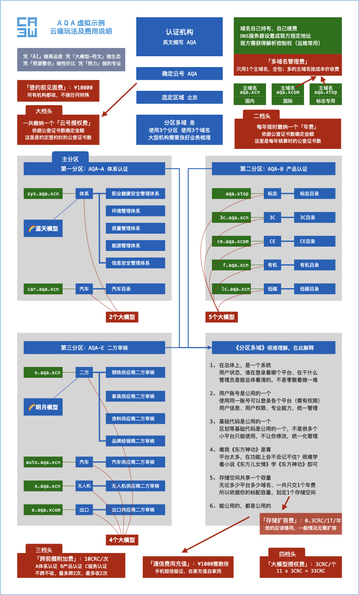

以东方文化为底蕴缔造轻奢认证机构管理系统 <br/>
适配高网速、符合时代，高维、上色、灵动 <br/>
主理人：麦修行（大江东去，唯我修行）

[麦修行][]&nbsp;&nbsp;&nbsp;&nbsp;[AI->东方神功][东方神功]&nbsp;[剧情][]&nbsp;[人物][]&nbsp;&nbsp;&nbsp;&nbsp;[原理][]&nbsp;&nbsp;[规则][]&nbsp;&nbsp;[价格][]&nbsp;&nbsp;[购买][]&nbsp;&nbsp;&nbsp;&nbsp;[Excel-Email][]&nbsp;[大模型-符文][]&nbsp;&nbsp;&nbsp;&nbsp;[发展历程][]

[麦修行]: https://github.com/ca3w/BEST
[东方神功]: https://github.com/ca3w/ai-dongfangshengong
[剧情]: https://github.com/ca3w/dongfangernvqing/blob/main/root/BEST.md
[人物]: https://github.com/ca3w/dongfangernvqing/blob/main/root/renwu.md
[原理]: https://github.com/ca3w/key
[规则]: https://github.com/ca3w/rule
[价格]: https://github.com/ca3w/pricing
[购买]: https://github.com/ca3w/howtobuy
[Excel-Email]: https://github.com/ca3w/excel-email
[大模型-符文]: https://github.com/ca3w/largemodel-rune
[发展历程]: https://github.com/ca3w/development

***

# 规则

不只是有模有样，更是有规有矩。

## 大原则


大原则是：所有高维、上色、灵动、质感等等一切高级的东西，都直接采用作者：麦修行，超前设计好的这一整套 <br/>
将你原来**基本数据管理**的那一套，导进来运用上，变成**高级数据驾驭**，就够牛了、就帅爆了、就是整条街最靓的仔

因为：超前设计好的这套，有对标研发的AI，是能快速高品质实现的。是属于超前大豪情投入，不能伤筋动骨大改

只需要：看《东方儿女情》、练《东方神功》、悟《东方战法》，这些是巨大投入反复打磨、精心实现的超前设计 <br/>
运用好，就可以了，而不是重新大折腾整个技术底蕴！应该和麦修行一起研究怎么运用！麦修行的价值，正在于此

你自己想实现公式中的：**{ (高维 + 上色 + 灵动 + 质感) x 成体系 }** ，即便十年八载，数千万的投入，也是难上加难 <br/>
找麦修行，按规则交钱，用云端就行了。更低风险、更低费用，快速信息高级化，轻松实现新时代的高级数据驾驭

## 大豪情

为什么`严格按规`？为什么`CRC`？为什么`风险额度`？为什么`无论是何种原因，均不予退还`？以及为什么`签约前见面费`？

借用网上一句话：**大部分都是“草台班子”**，也说系统，一句话就是：**大部分都是“草台底蕴”**。 <br/>
“草台底蕴”的意思就是没底蕴，说破了：**系统 = 数据库 x CURD套上你能操作的皮，50M，如此而已**

我是自己独立设计艺术的、专项的、体系的、完整的、真正的技术底蕴，是想真正做一个美好系统、是不一样的 <br/>
更多的是想成为一代宗师、缔造一代经典，是下了血本为超凡脱俗做的，而不是短、平、快，市场占有率那一套

一代宗师、一代经典：能用上的人或许不多，但让人觉得这个真的是个好系统、超凡脱俗、前所未有，这就够了

“草台底蕴”的系统就是垮掉的，但也得用，因为**大部分**都是“草台底蕴”，这个**大部分**接近百分百，因为好的难做

不做“草台底蕴”，要做真正的技术底蕴，非常难，甚至极难！ <br/>
作者：麦修行，是自己研发AI、自己琢磨底层，每天应对G级的代码，经过多年的努力： <br/>
才开窍的、才实现的：高维、上色、灵动、质感，那般给力，那般美好，那般现代，才有那种非常不一样的感觉

这个系统，高端上属于时代刚需，大气上属于当世稀有，档次上属于一代经典。有人卖、还是中国人，就不错了 <br/>
是可遇而不可求的，因为在难度上是属于“开山级”，但一旦做成，具有颠覆性：重新定义系统，开辟了新的文明

时代的格局 = 麦修行的豪情 + 你的豪情 ： <br/>
&nbsp;&nbsp;&nbsp;&nbsp;&nbsp;&nbsp;&nbsp;&nbsp;好芯片就像X轴，高网速就像Y轴，人们的品味就像Z轴，都在巨增 <br/>
&nbsp;&nbsp;&nbsp;&nbsp;&nbsp;&nbsp;&nbsp;&nbsp;如此XYZ，所撑大的格局，绝不是本地弄个50M小系统，小家子气就能够装载的 <br/>
&nbsp;&nbsp;&nbsp;&nbsp;&nbsp;&nbsp;&nbsp;&nbsp;开发者有多投入的豪情，机构有多花钱的豪情，两个豪情加一起，才有可能装下时代的格局

系统是什么？为什么上系统？通过系统，你才能连接时代的力量，进而玩转数据、驾驭数据、征服数据，赢得时代 <br/>
好系统是我通过这个，把高网速用上了，每次请求都传输大吞吐数据，好芯片也用上了，每个界面都在渲染富信息 <br/>
坏系统是我通过这个，高网速、好芯片都没用，你连接的不是时代的力量，你连接的是数据库管理、基本数据管理 <br/>
笨招判断：找台老电脑、网速限成4M/s，如果系统还能正常使用、什么都不影响，那不是兼容性好，而是不合时代

当然，我设计的这个系统，你没有20M/s的网速，是用不了的，电脑太老旧也是渲染不动的， 是真正的为时代而生 <br/>
4M/s的网速根本就用不了，这才是好系统，恰恰说明是大吞吐，这种系统才能连带着让你的现代环境配套发挥威力

现在，你弄那种数据库简单操作、套上皮点来点去，让人有一种为数据库当牛做马的感觉，早晚崩溃、白花钱得扔 <br/>
不如使用我设计的这个系统，我就有多投入的豪情，你也要有对等多花钱的豪情，我们两个豪情加一起，装下时代

你也要有的、对等多花钱的豪情，就是按规则算钱，算出多少就交多少，就是没有退钱一说，有了这个豪情你再买

## 大云端

系统不是冻结版本就能长期用的东西，而是真正有技术的人掌控发展其生态，购买者付费使用其适配时代的工具性 <br/>
价值就是：在线上能使用高维、上色、灵动、质感，这种举世难得的高品质，安全上每天变成Excel发到你的邮箱里 <br/>
发到你的邮箱里Excel也是高维、上色的，是和线上近乎一摸一样的（归宗），放下安全包袱，拥抱云端、享用好处

云端最大的好处是什么？ <br/>
&nbsp;&nbsp;&nbsp;&nbsp;&nbsp;&nbsp;&nbsp;&nbsp;答案：品质 + 性价比 + 解决时代刚需

这三个答案，是有深度的。涉及社会、技术、变迁、人性等全方位考量，不好细说，所以我只说三句，你自己细品 <br/>
关于品质：云端，开发者从零那一刻，就知道自己是有长期责任的。而本地部署交单式完成，开发者可能在想加密 <br/>
关于性价比：花20万买100M的本地用，200万买1000M的云端用， 是后面的性价比高，因为哪个你都得不到技术 <br/>
关于时代刚需：网速从4M/s变成50M/s，对于系统，属于巨变，前所未有，后所不及：因为再增不会引发系统变革

不只是云端，更是变革，而且是大变革！

## 大变革

大变革 = 大颠覆 = 重新定义系统 = 重新发明系统 = 一切都可以设计的更好 = 也就是说，我要改变很多、很多东西

我设计的这个系统，是属于大变革！是从 **低网速/小吞吐/穷信息/整页刷新** 变革到 **高网速/大吞吐/富信息/多源异步** <br/>
其灵魂是从 **穷信息** 变革到 **富信息** ，你可以自己问AI，了解相关知识，以及看我发的视频，了解系统发展的新趋势

这可能是全世界首个研发的、**富信息的**认证机构管理系统，属于无人区，很多革新点，作者麦修行也是探索式前进 <br/>
经过多年的探索、反复研究，以及长时间的摸索，2025年8月，作者麦修行，已经迈进了新时代富信息系统的门槛

## 大艺术

大艺术是：**你知道什么是好的，但你并不知道你的需求**。为什么你换了那么多系统、一直换，病根儿就在这句话里 <br/>
乔布斯有句话：“消费者，根本就不知道自己需要什么”，这话说得非常对！或许我设计的这个，才是你真正需要的

我提供给你的：只需要琢磨运用，不需要自己设计高级。所有高级，都是我已经设计好的，而且相互间是成体系的 <br/>
而且是像超市买东西一样，都标好价了，你买你需要的就可以了，包括未来改进都做成符文，让你做的都是选择题

***

> 大原则，大豪情，大云端，大变革，大艺术，总之，这个不一样，以下是云端规则：

## 区域

区域  |建议选择
:----:|:--------------------------------------------------
北京  |北京 天津 河北 山东 山西 黑龙江 吉林 辽宁 内蒙古
上海  |上海 浙江 江苏 安徽 河南 湖北
深圳  |深圳 广东 香港 澳门 广西 海南 台湾 福建 江西 湖南
成都  |四川 重庆 陕西 宁夏 甘肃 新疆 贵州 云南 青海 西藏

ping测速地址如下（目前采用的服务商是阿里云）：

```text
北京  $ ping oss-cn-beijing.aliyuncs.com
上海  $ ping oss-cn-shanghai.aliyuncs.com
深圳  $ ping oss-cn-shenzhen.aliyuncs.com
成都  $ ping oss-cn-chengdu.aliyuncs.com
```

## 云号

「云号」一般应是认证机构缩写，初次签约时和我方确定，一经确定终身不应该变改，极端情况的变改走特殊程序 <br/>
每个「云号」需要选定一个服务器所在的区域（北京、上海、深圳、成都，四选一），需要缴纳一个「云号授权费」 <br/>
每个「云号」需要每年按规定缴纳**一个**「年费」维系使用，否则视为弃用，会被销号，再次购买仍需重新获得授权

### 云号的分区多域

小型机构的云号都是单区单域（一个分区、一个域名），大型机构的云号可能会是分区多域（多个分区、多个域名）

#### 分区多域的合规性

同一「云号」下的所有「分区」、所有「域名」及「内容」，必须归属于同一个「认证机构批准号/认证机构批准书」

```text
A机构 开个分区，买个模型，绑个域名，给 D机构 使用，属于违规的，是不允许的
A机构 和 D机构 是不是一个，依据 「认证机构批准号/认证机构批准书」 来判断
```

#### 「分区多域」的统一「分区后缀」

分区后缀  |代表类别
---------:|--------------------
-A        |体系认证
-B        |产品认证
-C        |服务认证
-D        |培训管理
-E        |二方审核
-F        |认证机构的官方网站

特殊情况特殊后缀，具体情况具体协商

## 大模型-符文

拥有「云号」之后，还需要购买相应的「大模型」，依托「大模型」建立起应用（项目分类），才能进一步的使用 <br/>
大模型的好处，请看「[原理][]」里的《烤串共香原理》，有哪些大模型、符文，请看「[大模型-符文][]」 （没有可建）

所有的大模型，要缴纳「大模型授权费」才能放到你的云号里，我们不管哪个简单、哪个复杂，统一定价3CRC/个 <br/>
每个大模型的开发水准都一样：[AI->东方神功][东方神功]（80%+代码由AI完成），这个AI是我方用十多年的时间自己研发的

如果说你需要新模型，而模型列表里面没有，怎么办？或者说只是起了模型的名字，但还没有实质的模型，怎么办 <br/>
如果说是全新的模型，我方如清楚功能需求，只需要在很短的时间内（AI），就可以**较高品质**的做出一个全新模型

对于认证机构，选择正确的大模型，使用大模型，才能躺赢！因为只有「大模型-符文」的生态才能真正带着你发展 <br/>
否则，要么后买的总比你先买的好，要么就是一个不发展的冻结版本，所以：「大模型-符文」的生态是非常重要的

基于「大模型-符文」的生态重要性，我方执行以下原则：

* 所有的模型，都在你系统里显示（即时更新，未拥有，也显示）
* 所有的符文，都在你系统里显示（即时更新，未装载，也显示，是否装载尽量让你自己控制）

* 所有的模型，「[大模型-符文][]」里有显示（最低更新频率：每年）
* 所有的符文，「[大模型-符文][]」里有显示（最低更新频率：每年）

认证机构凭此把脉云端发展：以后我方和其他机构会陆续搞出新成果，你凭什么与时俱进？凭什么用上，就凭这个 <br/>
认证机构期望拥有某个符文，期望卸载、装载某个符文，都是免费的，不收取任何的费用，这样就实现了长期发展

哪种特别之处算作装载符文，以及相应符文叫什么名字，这个是我方决定的，所有机构只能是做选择题：要或不要 <br/>
新符文原则是：我方判断出是利好的、是无损可恢复的，我方代你选择利好，可能群里、朋友圈都会说，请你关注 <br/>
如果是变动较大，或者有损，我方会让你保持原样不动，如果你倾向新符文，看清描述，需要装载可以按要求装载

## 云号总结

以上就是我设计的认证机构专用云端，核心主要玩法：云号/分区多域/大模型-符文，三个层级的一个基本的逻辑 <br/>
功能体系是我看电影产生的武侠思想，融入现代技术而设计的，大致思路是[《东方儿女情》][剧情]->[《东方神功》][东方神功]->AI

## 严格按规

永不议价，不搞优惠，不搞活动，严格按规，算出来多少钱，就是多少钱。没人比你少花钱，也没人比你多花钱

这件事情，我将会用一生的时间去做，我就是要做好的，价格透明你自己能算的，这样的认证机构专用的云平台 <br/>
为了实现，我制定了锚定CRC的价格标准，我会严格执行，让认证机构有一个新选择：**用云，按规则交钱就行了**

## CRC

CRC：粗(Cū)算 人(Rén)工 成(Chéng)本，以「1.5倍上海社平工资」为核定标准，即 1 CRC = 1.5倍上海社平工资 <br/>
抹零：CRC抹零抹到百位（例如：12399.00 -> 12300.00），由CRC计算的价格也统一抹零抹到百位，避免争议

CRC最新取值：[CRC][]

[CRC]: https://github.com/ca3w/pricing/blob/main/root/CRC.md

## 风险额度

由于软件开发的特殊性，在合同签订，以及项目启动时，以保证金的方式、向我方预先支付金额，叫作：风险额度 <br/>
不只是风险额度，任何费用一旦支付，无论是何种原因（包括但不限于合同终止、违约或主动放弃），均不予退还

## 四大档头

想使用我设计的云平台，需要花钱。花钱最多的四个地方，就是最大的阻碍，这四个较大的费用被称为：四大档头

#### 大档头：云号授权费（按约定签约时的公查证书数，确定金额）

每云号，交一次，具体金额参见下述价格标准

#### 二档头：标准年费（按每年核算时的公查证书数，确定金额）

每云号，每年交，具体金额参见下述价格标准

首年自约定正式上线日起，按天计算支付至当年年底。以后每年在统一缴费期限内完成付费，年费只支持按年结算 <br/>
次年以及后续的年费结算，只支持按年统一期限结算，不支持按半年、按季度、按月、按天等任何其他方式的结算

如果年费欠费不足或逾期，后台会以弹出警告的方式，首次欠费仍保持运行一个月，如果还不能完成续费，则终止 <br/>
如果我方能得知具体情况，会根据情况做相应的处理。请按规则规定的统一的时间，及时足额的支付下一年度年费

#### 三档头：跨前缀附加费（固定：10CRC/次）

固定：10CRC/次

所用大模型，其前缀字母，跨越ABC，即：体系认证、产品认证、服务认证，则收取跨前缀附加费，最多收取2次

* 首次，体系认证/产品认证/服务认证，A/B/C，只做其一，不收跨前缀附加费
* 后续，增加大模型，原A加B或C；原B加A或C；原C加A或B，收1个跨前缀附加费（第1次）
* 再加，体系认证/产品认证/服务认证、全涉及，ABC都有， 再收1个跨前缀附加费（第2次）

风险额度的计算：2CRC（五分之一） <br/>

#### 四档头：大模型授权费（固定：3CRC/个）

固定：3CRC/个，不管多复杂、多简单，都是一个价、都是相同开发水准

理论上，一个全新的模型，如果能够大幅度基于蓝天模型、白云模型，还是在我方有自研AI的这个储备能力前提下 <br/>
还要预先沟通清楚，才有可能在100天内，高水准实现（符合东方神功、东方战法高维、上色、灵动、质感的那种） <br/>
也有可能更快、也有可能200天、更长，具体的情况，和多种因素有关，不能一概而论。如果是既有模型，会很快

风险额度的计算：3CRC（全额） <br/>
这个是按大约最低的工时成本（100天）定的成本价，全额纳入风险额度，多个模型如果担心，可以一个一个的做

## 价格标准

编号  |公查证书数  |云号授权费<br/>总额  |云号授权费<br/>风险额度  |标准年费  |标配容量  |编号
:----:|-----------:|--------------------:|------------------------:|---------:|---------:|:----:
X4    |80万+       |3000CRC+             |100CRC                   |200CRC+   |160T+     |X4
X3    |30万-80万   |3000CRC              |100CRC                   |200CRC    |160T      |X3
X2    |20万-30万   |600CRC               |100CRC                   |60CRC     |60T       |X2
X1    |10万-20万   |500CRC               |100CRC                   |50CRC     |40T       |X1
C5    |5万-10万    |300CRC               |60CRC                    |40CRC     |20T       |C5
C4    |4万-5万     |240CRC               |48CRC                    |39CRC     |10T       |C4
C3    |3万-4万     |210CRC               |42CRC                    |38CRC     |8T        |C3
C2    |2万-3万     |180CRC               |36CRC                    |37CRC     |6T        |C2
C1    |1万-2万     |150CRC               |30CRC                    |36CRC     |4T        |C1
A9    |9千-1万     |120CRC               |24CRC                    |29CRC     |2000G     |A9
A8    |8千-9千     |110CRC               |22CRC                    |28CRC     |1800G     |A8
A7    |7千-8千     |100CRC               |20CRC                    |27CRC     |1600G     |A7
A6    |6千-7千     |90CRC                |18CRC                    |26CRC     |1400G     |A6
A5    |5千-6千     |80CRC                |16CRC                    |25CRC     |1200G     |A5
A4    |4千-5千     |70CRC                |14CRC                    |24CRC     |1000G     |A4
A3    |3千-4千     |60CRC                |12CRC                    |23CRC     |800G      |A3
A2    |2千-3千     |50CRC                |10CRC                    |22CRC     |600G      |A2
A1    |1-2千       |40CRC                |10CRC                    |21CRC     |400G      |A1
A0    |0-1千       |30CRC                |10CRC                    |20CRC     |200G      |A0

统一配置： <br/>
&nbsp;&nbsp;&nbsp;&nbsp;&nbsp;&nbsp;&nbsp;&nbsp;上传文件：单个文件最大不能超过20MB

即：大档头：云号授权费，二档头：标准年费，都是依据这个表来计算，点击「[价格][]」查看代入CRC后的具体价格

风险额度的计算：五分之一，最低10CRC，最高100CRC

## 除四大档头外的其他小费用

#### 签约前见面费（固定：¥10000）

由于我方针对的是全国机构，不是本地，所以：不只是不自己搭车马费，更重要的是不乱耗时间，所以有这个费用 <br/>
我方不是开发个版本冻结了，卖一个赚一个的那种，时间用于优化大模型-符文、好几个G的代码，以及一系列问题

对于有些犹豫，还不大能做决定的机构：可以关注我们，等你想清楚了，基本上能做决定了，再与我们约时间见面 <br/>
总之：我方产品是录视频发布的，[东方神功][]也是公开的，价格是制定标准严格执行，不搞特殊化你自己能算出费用

#### 多域名管理费（1个免费，多个成本价）

一个云号，只用1个主域名，包https、包DNS旗舰，第2个及更多的主域名，按成本价收取https、DNS旗舰的费用

只用1个主域名（子域名可以无限使用）不用管这个，都是包的，如果一定要使用多个主域名，多的按成本价付费

> 依上游厂商的成本价而变动价格，我方并不以此盈利

#### 通信费用充值（¥1000整数倍）

手机短信验证，自家充值自家用，以及一些可能的、其他的第三方接口费用，系统内做好明细，我方并不以此盈利 <br/>
所有第三方费用，都是可以选择的，是否使用由机构决定，我方不强制使用，有些第三方接口，能提高些用户体验

#### 存储扩容费：0.3CRC/1T/年

正常情况，给的「标配容量」，应该是够用的，不应该有这个费用。但如果超出了，不只是付费，而且还需要反思 <br/>
请看[《东方神功》][东方神功]中的[《治粟兵法》][]，我们有[《治粟兵法》][]，以及合理的规划文件配额，这个费用根本就不会产生

如果容量超出，使用方应配合我方，在双方的共同努力下，优化文件存储，避免掉这个费用，使长期能够健康发展 <br/>
另外系统会定期的统计文件使用情况，如果发现大量出现单组织、单活动配额严重的超标，给出预警及相关的建议

> 此种计费方法，只适用于小范围超额（20T以内），如果是大范围超额，视同超用云端资源，具体费用需要协商

[《治粟兵法》]: https://github.com/ca3w/ai-dongfangshengong/blob/main/root/bingfa/zhisubingfa/BEST.md

```text
反思什么？
我给的配额是经过计算的，应该是够用的，如果超出了，你应该反思你系统的文件规划，有问题
    单组织的文件配额，应该多大？（这个，应该影响不会太大）
    单活动的文件配额，应该多大？（或许，罪魁祸首就在此处）
不过不做规划、任其肆意发展，那么：当你证书数破十万以后：那服务端的成本在哪里都是高的

或许你认证机构的管理，没考虑文件配额的这个问题，需要优化管理，解决存储文件过大的问题

```

## 费用总结

上系统的费用逻辑是什么？

第一步，查「大档头：云号授权费」，这个金额较大，整个机构，一个云号，是一次性费用 <br/>
第二步，查「二档头：标准年费」，不管你具体怎么用，这一个年费全包，是每年都要交的 <br/>
第三步，往自己的云号里做大模型：「三档头：跨前缀附加费」和「四档头：大模型授权费」

其余的费用，都是小费用

***

# AQA 虚拟示例

下面是虚拟的一个认证机构 AQA ，使用我方云端，云端玩法及费用说明，你可以根据这张图对照着上述，思考自身 <br/>
所有的费用， 这张图上都有，没有其他别的收费， 你可以琢磨符合自身情况的：大档头、二档头、三档头、四档头


